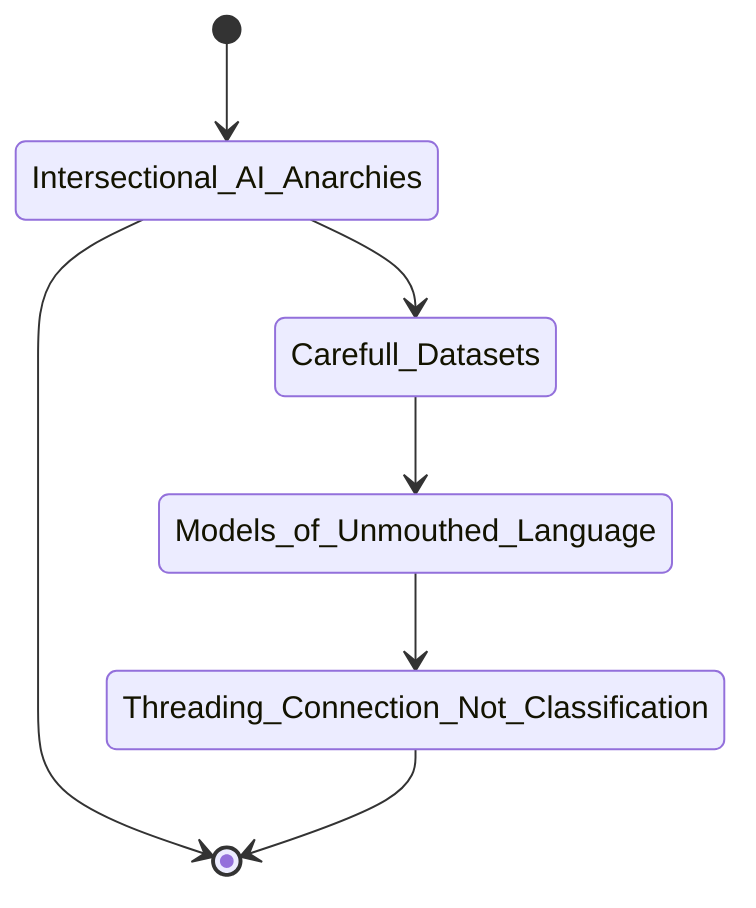

[Akademie der Künste JUNGE ACADEMIE Fellow](https://www.adk.de/en/academy/young-academy/ai-anarchies/) in Berlin. Six artists will develop new works on the topic "Artificial Intelligence (AI) and Ethics" during a six-month residency programme at ZK/U in Berlin titled "AI Anarchies." The invited artists' projects will be shown in a final presentation between May and July 2023 at Akademie der Künste. My work is furthering the Intersectional AI Toolkit findings to imagine Intersectional AI tools for tangible, accessible machine learning. 

## proposal

The Anarchist’s Tool Chest says there is power in a small set of tools, known intimately and carried easily. Its author Christopher Schwarz calls this "a radical and rare idea that can help change the world." This idea is missing from AI tools, which require massive technical knowhow and financial resources to operate. But the Intersectional AI Toolkit argues that anyone should be able to understand what AI is and what AI ought to be.
AI systems disproportionately harm marginalised communities and further marginalise those whose perspectives are most necessary in order to face the challenges technoculture presents. Intersectional AI calls for demystifying normative AI systems and learning from marginalised ethics and tactics, in order to fundamentally rethink AI. Intersectional approaches are essential to ensuring more inclusive, imaginative AI for everyone.

The Toolkit’s zine library and workshops gather ideas, ethics, and tactics for creating and supporting more equitable, ethical tech, while reexamining the foundational assumptions built into these tools and their language. Certainly not the first project to examine inequality in technology, the Toolkit celebrates long lineages of intersectional practice and shows how established queer, anti-racist, anti-ableist, feminist communities contribute necessary perspectives to reinventing the digital systems that affect us all. As social practice, its zine-making workshops involve international audiences to co-author the Toolkit, cultivating caring and tech-aware communities via iterative, tactile techniques.

During AI ANARCHIES, I propose applying the values and methods of the Toolkit toward a tangible tool that asks what an Intersectional AI Anarchies Tool can be. Public workshops will guide implementing the Toolkit’s frameworks, and bimonthly open studios will involve community and invited collaborators in co-creation, to be documented with risograph-printed zines. An IAIA Tool will emerge on-site but be grounded in my work with large language models that combines text generation, text analysis, speech synthesis, and sentiment analysis—especially bias and error: *Whose voices, visions, and stories are captured by automated systems? Whose are excluded, injured, undermined?*

By laying bare AI’s processes as tactile and fallible, I invite audiences to explore error as a site of resistance, an avenue for anti-capitalist value, a space for rethinking their entanglements with automated systems and each other. The installation will let visitors donate data, imagine systems that prioritise care, and embody new relationships to automation as co-creators. An Intersectional AI Anarchies Tool reimagines technoculture as truly being for anyone—to understand, impact, and intervene in.

## #currentlyreading

- Amoore, L. (2020). *Cloud Ethics*.
- Asimov Institute. (2016). [Neural Network Zoo](https://www.asimovinstitute.org/neural-network-zoo/).
- Crawford, K., & Joler, V. (n.d.). [Anatomy of an AI System](http://www.anatomyof.ai).  
- Ingold, T. (2015). *The life of lines*. Routledge.
- McQuillan, D. (2022). *Resisting AI*. Bristol UP. 
- Sedgwick, E. K., & Goldberg, J. (2012). "Making things, practicing emptiness." *The weather in Proust*. Duke UP.
- Schwarz, C. (2010). *The Anarchist’s Tool Chest*. Lost Art Press.

### questions literally too big to answer but that still need to be asked
- who are the authors of the 195 billion 380 thousand 885 total words that trained GPT-3 (195,380,885,914)? 93 percent of them in English. (181,014,683,608 English words and the other 14,366,202,306 in other languages)

- what's the ML equivalent of learning network protocols for handheld radical tactical practices

- *see [design doc](designdoc) for more thoughts in progress*

## winding and unwound threads

tethered.networks, crochet, unicursal purposeless paths (labyrinths)

 | {: .thumb }



<!--    
# Autumn School Day 1 Workshop "Self-Hosted" with Sarah Grant

* log into server
>```ssh [login eg root]@[ip eg 95.217.234.88]```

* make a non-root user
>```useradd -m -U -s /bin/bash -G sudo [newuser]```
>```passwd [newuser]```

* edit file to harden server access, make secure
>```nano /etc/ssh/sshd_config```
>`PortNumber` (change to any) (most important for bot scanners) [eg 903]
>`MaxAuthTries 3`
>`MaxSessions 5` (not 1)
>uncomment `AuthorizedKeysFile`
>AllowAgentForwarding yes
>AllowTcpForwarding yes
>ClientAliveInterval 300 (how long to wait to ask if you're alive)
>ClientAliveCountMax 1 (how many is client still alive checks to send)
each app has it's own door to the building, the port
default mail 25, ftp 21, web 80. safe generally 3 digit and up
suggested to use something under 1024.
save w cntl x

additional things you can do... (unohost is updating)
- not allow root, login w key, etc

"wordpress 75% of web, notorious for getting hacked/spammed"

* reload system
> `systemctl restart sshd`

* ssh keypair creation

* run the yunohost install then the rest on the site (firefox)
>```curl https://install.yunohost.org | bash```

* choose one of their subdomains unless you are ready to set up your own [eg `untethered`.younohost.me]
* create a new user [may need to be diff from your user created earlier in terminal]
* run initial diagnosis - (reverse DNS is needed for email, have to request port 25 unblocked after first bill paid mb)
* install a Lets Encrypt certificate Domains>Certificate

- Roundcube (mail)
- Nextcloud (office)
- Converse (chat)

* backups made manually inside yunohost interface

* for your own domain set the A records to the ip address on your server admin panel, see younohost hints

-->