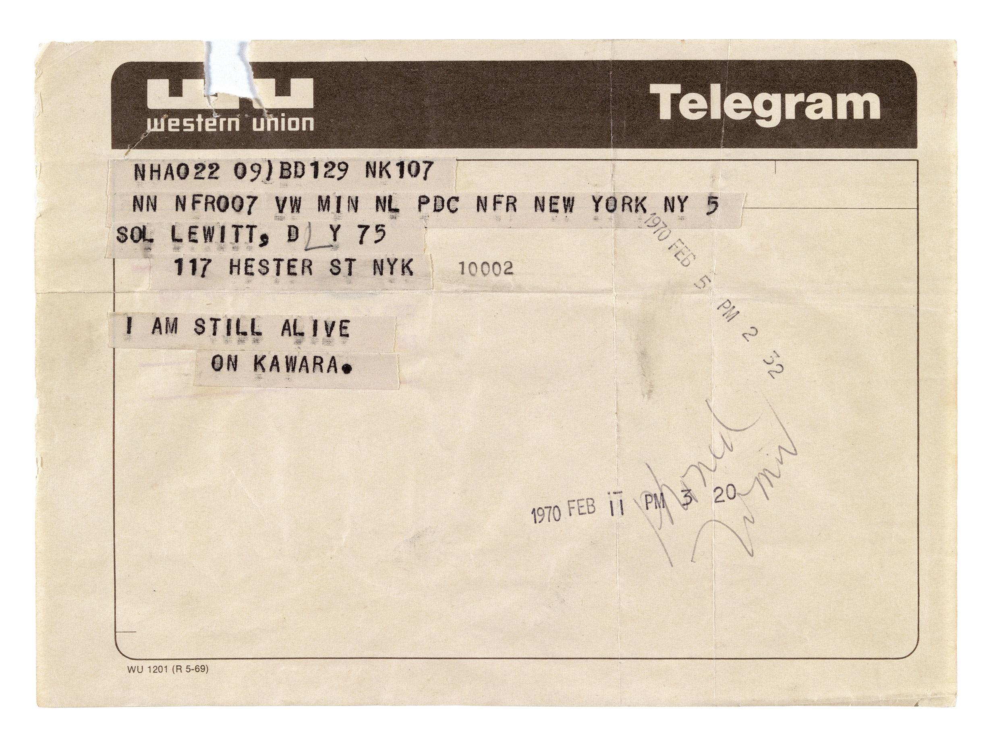
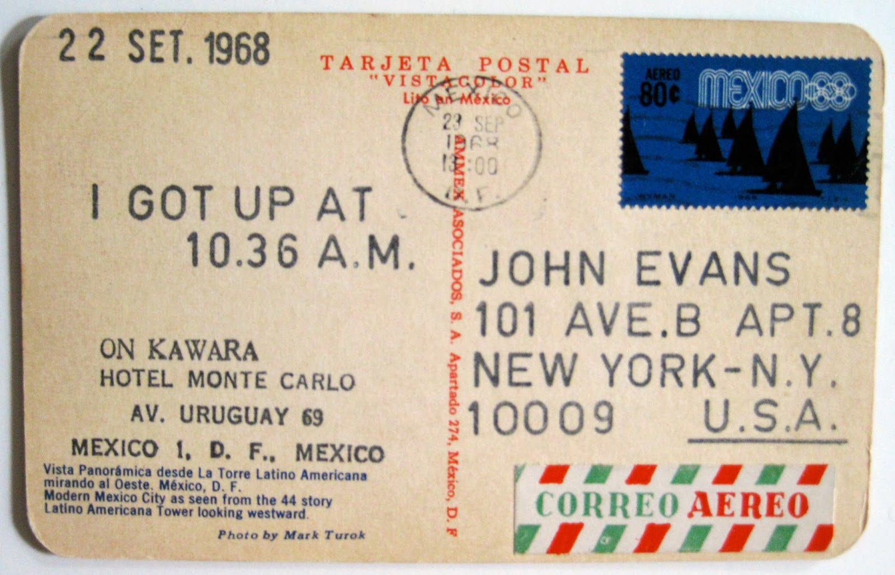

# Codes for (Un)Living

>"Find something to adore and keep talking to it." –Martin Shaw [-@shawCourtingWildTwin2020]

I am still alive, On Kawara.  It takes so much: To get up, at a time. To make a painting. To make a day. Day after day. You fit this feeling in a postcard. You report the dailiness and so it is remarkable.

What I like about you is you don't offer any context. Just 'I got up'. Just 'I am alive'. 'Still', like it's a chore. What more do you want from me, you seem to say. 

You wrote to Sol LeWitt. Wrote to friends in New York, France, Sweden, Yugoslavia. You wrote every day for days and days and days and days until you weren't alive. But I am still alive. It doesn't feel remarkable, but it is. 

Some people I know are also alive but don't want to be. It's hard to know how to live, especially right now. And it always has been hard to know how to live. It always has been 'especially right now'. But we make our problems our own. We evade oneness with simple words like 'I'. We do it on the reg. 

Such data accumulates days. Call it a lifetime.

You chose a few basic rituals and stuck with them. Sometimes the only affirmation a person can hold is 'I am still alive'. Sometimes it is all we can stand. Sometimes that is enough. Sometimes even that is too much.

===

I got up at 9:50am. I woke up several times before that, but I didn't get up. In your 'I got up at' postcard series, the times range wildly. This makes me like you more. I resent shows of dedication that seem to claim the moral high ground as the secret to success. Like if I really wanted to 'be an artist' I would have gotten up at 4am — as if this is the formula for everyone, as if we share the same capacities and resources[, as if some people don't also get up at 4am to go to their second or third job].

On Kawara, how were you feeling on APR 3 1969? I triangulate a mood from two separate pieces you made that day. Some days you made contributions to many datasets. Along with 'I am still alive' and 'I got up at', you often made 'I went' and 'I met', which indexed your daily travels (on a map) and interpersonal encounters (in a list of names). On APR 3 1969 you got up at 2:56 PM and made a very tight path around your neighborhood in Manhattan. Just four blocks by four blocks. Maybe you only went out to mail the postcard that said 'I GOT UP AT' and to eat or to shop for a meal. Maybe you didn't eat. I assume you met with no one, because I could not find the data. Although you were still alive, you sent no telegram to confirm. 

I recognize such knotted neighborhood walks in my slowest days. I don't mark these patterns down in red pen (except for one photography project in college in which I traced everywhere I drove in Los Angeles on a map before an app did this for me), but I have always seen my 'self' from this angle — small, [on a map,] abstract in relation to concepts like 'north'. I notice how little my movements cover the earth. I like places where I can get up high or see far, until the horizon seems to curve. I think, 'I am on a planet', and the smallness I already feel is more palpable. 

On other days, when I am more in a body, I notice how much space it takes up — how it barely fits where it's told and it aches and it moves like my mother's body now. I worry how much ecological impact it contributes. I let in all these tracing technologies to admit to the uncanny feeling I already have. But the sense of being traced by satellites is not your telegram path or paintbrush. This is something different from presence and displacement. [Attunement is not technical alignment.] "Melancholy is a latent or paused anticipation of something necessarily unknowable" [@robertsonNillingProseEssays2012]. Despite all my settings, I know the maps know where I am. I know my mom can pull up her phone and find me: a tiny dot pulsing, still a 'live' representation. I leave this on because she likes it more than it bothers me. If a drone can find me, my mom might too. 

<!-- [^a-life]: How did 'live' come to mean 'current' instead of 'to live' or 'alive'? Conway's Game of Life is the best known example of 'a-life', or what's called artificial life, a basic algorithm in which a small set of rules play out into infinite complexity over thousands of cycles. Its shapes can be followed like an unnatural ant farm: 'gliders', 'guns', 'crawlers', and 'eaters'. Nothing about this feels 'lively' to me, so life must be something else. Its patterns look to me instead like knitting patterns for lacework.  -->

===

On Kawara, like you, I also made artwork that tracked my daily habits. I collected as many streams of the data I was producing as possible. To over-know the body through data was eventually to say nothing much at all. Collecting turns being into producing, a new kind of labor where I do nothing but my body makes a profit that estranges me. Over-thinking meaning, over-writing data, working-over my overworked datapoints, rewriting the read-outs — in the ads I can become one minor market for my dataself. I can replace proprioception with real-time sensor feedback. Replace interoception with outputs and analyses. 'Live' tracking my heart rate seems redundant but appealing. It offers the illusion of insight if I offer the sleeping, reading, breathing, thinking I am already doing. By tracking it, extracting it, selling it, the devices turn living into labor. Their proprietary systems make it valuable, not me. My sleeping, reading, breathing, thinking doesn't matter until it's data. Every day I get up at, and I check my heartbeat. I check the devices which tell me, 'I got up at', and I charge these devices. I spend money and time and labor on them. Every day their systems know about me, just like Sol LeWitt knew about you from your telegram. But we're not friends. The data I create now implicate me in advance — of actions I haven't taken and devices not yet invented and crimes not yet described. Sometimes 'I am still alive' is already giving too much away.

I felt young and girlish when I made data art. I felt selfish. [Would I have felt that way if it was someone else's data, someone less young- and girlish-seeming?] I got constructive criticism like, "You sure do sleep a lot. Are you depressed?" On Kawara, I think I slept about the same as you, and I'm sure we are both read into, and I suppose that is some part of the point, but I still didn't like the feeling. 

So instead I made artworks that asked other people to share. I asked for compassion, in small portable phrases, because I needed to learn to like it. I wanted phrases that could be turned from sound into writing into data packets into sound again. I thought machine learning would be a faulty tool for this, and I wanted to show the faults. Art-making was a way to make it weird. 

I think you've noticed this. You take a normal thing, like writing down the date, and you make it large, you make it weird. Art works best when I'm as uncomfortable as possible. To speak to myself with compassion, I had to make an artificial voice that sounded like an uncanny version of me, using other people's words, being kinder than I was capable of at the time. I hoped that simple words from others, transmitted repeatedly, would [rewrite/rewire] the [protocols/circuits] in my head, just as they had [written/wired] them in the first place. 

"IT'S OKAY TO CRY" is tattooed on my arm in calculator font. I need the phrase written on my body so that one day I will start to believe it. The affirmation had already appeared in the participatory database of compassionate phrases I made. I am always surprised that the database "works": People contribute to it; it soothes effectively, even if you know its gimmicks; and its speech-to-text-to-speech processors make poetic nonsense out of earnest feeling. I see how much gunk this machine spits out, and yet I am still ready to believe it. 

===

Researchers are now using machine learning to detect potential suicidality, particularly in children and veterans. Machine analyses of video, writing, and medical records found a wide range of correlations: "people experiencing suicidal thoughts sighed more and laughed less than others. When speaking, they tended to pause longer and to shorten their vowels, making words less intelligible; their voices sounded breathier, and they expressed more anger and less hope" and "having arthritis, lupus, or head-and-neck cancer; taking statins or Ambien; or living in the Western U.S. can also add to a veteran's risk" [@khullarCanTreatMental2023]. Their predictive models pinpoint high-risk adults; they find children who may soon become anxious. 

This worries me. Maybe it shouldn't, but my mother always labeled me a worrier. I worry that machine criteria makes almost all of us suicidal. Do you pause longer than others? Do you live in the Western US?

Looking for patterns, we find patterns. But what do we do with the patterns we find? How far would I go to limit someone's life to prevent their death? 

===

Someone reminds me it is not my responsibility to keep other people alive, no matter how much I care for them. 

But then, whose job is it? We all keep each other alive. And lately we are failing at this work, failing at dramatic speed. Unaliving at accelerating pace. 

**For the last 100 days each day a girl posts a video online from Palestine that says, "This is Bisan. I am still alive." She knows the next day she might not.**

'Unalive' rewrites unspeakable death to avoid censorship by platforms. Platforms do not read for context clues. They cannot distinguish between deaths to discuss and deaths to erase. They cannot distinguish between queer sexuality and pornography, although they do claim to be able to distinguish between a male nipple and a female nipple, even though gender is not real. Still we must spell out new stuttering formulations like `s3x` and ~~`death`~~ and `les`\emoji{bee}`an` and `$uicid3`, to con these 'sophisticated' systems by hovering in the redacted [neither-and]. 

And speaking of the void, recently [they] added a Boolean operator to Javascript called Nullish, written `??`. (I know, right? My feelings exactly.)

Nullish distinguishes `null` and `undefined` from `False` and `NaN` (Not a Number), although all of these are considered "Falsy." Nullish hovers liminially in the never-was or maybe-erased. Use plain ol' `null` "when something can optionally exist." Nullish is meant for "when there are multiple ways something can not exist"[@massoHandlingNull]. 

Oh, to be Nullable coalescing, there or/and nothing. 

>"the fractal dimension of compassion is that of not self, not other, not both self and other, and not neither self nor other" [@sedgwickWeatherProust2012]. 

===

I should have known your series "I AM STILL ALIVE" began with un-unaliving. In DEC 1969 over three days you sent: "I NOT GOING TO COMMIT SUICIDE DON’T WORRY"; "I AM NOT GOING TO COMMIT SUICIDE WORRY"; and "I AM GOING TO SLEEP FORGET IT." For whatever reason, I like these telegrams less than the nearly 900 telegrams you went on to write that simply said, "I AM STILL ALIVE ON KAWARA."

You are not still alive. I write to you as though you are, because to write to the living who do not want to live, to write to them about living, seems harder than to write to the dead about living. I expect you'd have more to say about living, having written "I am still alive" so many times. After remarking so often on the stillness of living, I think you would you report back that living was hard. Maybe you could explain to my friend, who does not want to, why you went on and did it anyway. 

Sometimes unprompted, sometimes in reply to requests and inquiries. Your telegrams enacted your persistence as a refusal, as if to say, "I'd prefer not to," or as if to emphasize that your status might change in the widened gap between sending and receipt of signal. 

I get text messages almost every day. Some of the messages are reports of forgetting, frustrations about forgetting, and anticipated forgettings. I feel like a throbber, a spinning rainbow beach ball of doom, three dots awaiting the arrival of a message being revised. I hold my breath and wait for something to be over, which I don't want to happen at all. I ignore my heartbeat, though it wooshes in my ears, though my devices capture it as data all the time. *Are you, or have you ever been, an anxious child?* 

I don't get many text messages from my friend, On Kawara, the one to whom I'd like you to explain the stillness. There are no telegrams, no tiny pulsing dot on a map. Every few months I get a meme, or a bulk message of twenty memes. I am learning these must suffice [for friendship]. These mean 'I am still alive'. It's futile to telegram back each day, "Are you?" "Still?" "And now?" 

On Kawara, you tediously completed each date during the day it depicted. Each of your almost 3000 Today's  was white on monochrome ground. The days "index only themselves" [@kawaraKawaraSilenceOccasion2015]. 

Now, how do we index the days?

The too-smooth silence of drone footage over destruction. Calm voiceover gliding above a bombed-out city. 

For Audre Lorde, just to live can be an act of revolution: to survive in spite of powerful forces striving to extinguish you. So many of us live on the backs of others. And so many of us live as acts of devotion.

I am still alive. Most days it doesn't feel remarkable or enough. I don't know how to explain the stillness, the going on. It's okay if you stay in the Nullish. Just mark the days. Let something mark them for you. 

===

### reading comments

footnotes get skipped over. reading aloud works

unfamiliar, uncanny atmosphere, two novels: David M wittgensteins mistress, christine __meyers Landscape. references. role of tech, dead/living/ communication with past. contemp nonfiction taking tone of postapocalypse. lean into  . hearing it from an AI voice 1000 years from now alone on a loop. 

slashes, word choices, tangible references. data and coding, feels tactile. seeing all together pleasurable even if scared of code it's okay. 

a cumulative effect of on kawara. how the text replicates this, effective. 

six sections distinct chapters, all loops together, progression intros us to code, section four is heavy, movement between i and address, beautifully with larger project. 

approach OK with distance of time diff moment with digital devices, his quiotidian dates/postcards/labor in context of auto tracking/collection, mother's experience of me. expand: 1) anecdotes of people kowara wrote to, commercial, vs friend, analog/epistolary; 2) couldn't see my data art practice, describe more detail, put picture in. 

agree see artwork. sincere, close to writing, caught off guard. strong observation of how we approach mental health with machine learning. medicine and AI used together long time. how far patterns go to describe us or categorize us, where to find a balance. 

technical writing, new categorization of nothingness, does increasing categorization of nothingness make it go away or create another type of order, reads funny next to falsy.

putting my art in conversation with OK's in question with aliveness and what data collection has to do with this. pulled in to what could recognize more easily, the relations, tracking the people: mother, friend. wanted to see the art. the task felt like making those connections between writer's art and their relations' potential aliveness or writers' anxiety, question of care and mothering, triangulation of mother's caring through technology and writer's same care for friend through technology. anchors/structure. 

reminded of hugh lemine, hildegard unknown language, bahnu kapil. reforges new definitions of familial intimacy, when we're asked to reevaluate ourselves as data points. want to hear more about figure of/spectre of the drone: if a drone/mother, appears again at end, harbinger of violence, unexpected, different scale of the other violences, curious about it and difficult to reconcile. 

word choices [/] adds personal encoding, add to the personal on OK's side to parallel own experience. most compelling the language we're using with the personal vs computational "unaliving" stronger connections to the change in our own understanding. more?

grounded in presentness, heartbeat, rhythm, didn't need to see artwork in but as companion, 

Lisa: drawn to granular way addressing pro/con allures and scary aspects of crimes/self body. interesting way in. spectrum. the commercial aspect of the art i discuss, my dissertation part of a larger economic system that expects from me. *the personal being so closely tied to economic interests.* time creates something not tied to a moment because of how pitch things tied to me and not tied to me, the violences opens a way to think about time in a way, what's being recorded, not pinpointing but describing. 

Ashley: tactile, images. font. coding. reflected what text is doing moving through time w different types of technologies. pointing to ideas that as tech advances comm becomes easier but less personal. telegraph/postcards a physical thing vs receiving emojis in months. echo but reflect change in effort and personalization, reflects the distance between people. Syntax: blunt and fragmented, contrast w the research integrated. truncated abruptness reflects the postcards. epistolary to write to someone who is dead, addressing the format, as a way to explicitly address the act of living. 

very visual, presentation as reading in a circle. OK 1000 days 1 million years, performance of reading the numbers 1-100000. writing about displacement and mapping as a dot perspective, way to concider care and safety and embodiment and transencoding. postcard/male documentation. care and how you view someone as family. sleeping section, curious to know more, as a way of dreaming, coretical sleeping. 

not needing to see the artwork, pulsing dot visually present throughout. the dates and time connected w personal experience felt like i was mapping something. transform something cold robotic, distant to personal and breathing. 

how someone sends a telegram. the technical stuff. how he made the postcards. 

<!-- [^Shaw]: Shaw, M. (2020). *Courting the Wild Twin*. Chelsea Green. -->

<!-- [Lose the 'I' nullish, make it remarkable, live as devotion/make it something, nondatifying. And it must be.] -->

<!--There are backup plans with banking details. [for if the order of who-dies-first goes wrong]. [I am the next next-of-kin, and this may be resisted.]--> 

<!-- You find your own reason.  -->

<!-- On Kawara, you kept it up for 29,771 days, which seems like plenty. [There are as many people dying right now.][I am happy if everyone I know sticks around that long.] -->

<!-- [For blood relations we talk a lot about ways to prevent, and to get away with, death. Farming. Hunting. Euthanasia. Murder-suicide pacts. Justifiable homicide. Hypothetically, of course. If the occasion called for it. Death is brought up casually, at a birthday dinner or on a video call[, like some folks talk about [reunions]]. -->

---
<!-- null, queer use, throbber, waiting for something to happen, platforms, queering, communing, desiring, ecstatic codes, -->
<!-- data bodies, drone aesthetics, interpolated and interpellated states -->
<!-- A simple act of reporting. Distributing data, is always personal.  -->
<!-- tech wants to address the problem of scale but it also contributes to it -->
<!-- In the past we got it from women, trained to be wives and mothers and ignore their own readings. We look for it now in machines because we don't have enough hands on deck to provide care (because we are not willing to provide it mutually?).  -->

<!-- return to the anxiety of too many too much asked of me, no one asked, i asked this of myself, all the things i am excited for, imagine making and doing and joining
code palimpsests from Annette Vee, looking at Bakhtin's speech genres, each utterance a refraction of prior. -->

<!-- [It combines two pieces of flash art created by [Ren], who wanted to honor the life and work of musician, producer, and trans rights activist Sophie Xeon after she died unexpectedly in 2021. She slipped and fell while climbing up to look at the moon.]  -->

<!-- 29,771 days. I'm happy if everyone I know sticks around that long.] -->

<!-- >"needed a proxy for" "The algorithm’s designers needed a proxy for illness and settled on medical costs. (All things being equal, people who are sicker tend to use more health care.) Obermeyer found, however, that the algorithm dramatically underestimated how sick Black patients were, because the Black patients it examined had much lower health spending than the white patients, even when they were equally sick. Such algorithmic bias can occur not just by race, but by gender, age, rurality, income, and other factors of which we’re only dimly aware, making algorithms less accurate."  -->
<!-- >"text-based therapy can work well. It also generates data." -->

<!-- >"human raters focused on content, while the machine algorithms focused on structure." [@pestianSuicideNoteClassification2010] -->

<!-- And with ES9, ... the ellipses copies or clones objects. Whereas Winnie Soon discussed the throbber, and we have the rainbow beachball of doom, and the three dots of death, awaiting arrival of a message being written, or revised, or deleted, one never knows. Here an abundance. A Dolly the Sheep Dot Dot Dot.  -->

<!-- It feels different, attunement with a sensor that tells you of someone's vital signs, and across a distance, the way you receive a telegram and know that when it was sent the sender was still alive. 
Writing to no one, a postcard out into the world (Derrida) vs an "entity" that senses your increased biometric feedback and responds to you. This desire for attunement.  -->

<!-- [xxx]Attunement across a distance means a sensor telling me your vital signs or a telegram sent when you were still alive. These feel different. Alignment in machine learning is [xxx] -->
