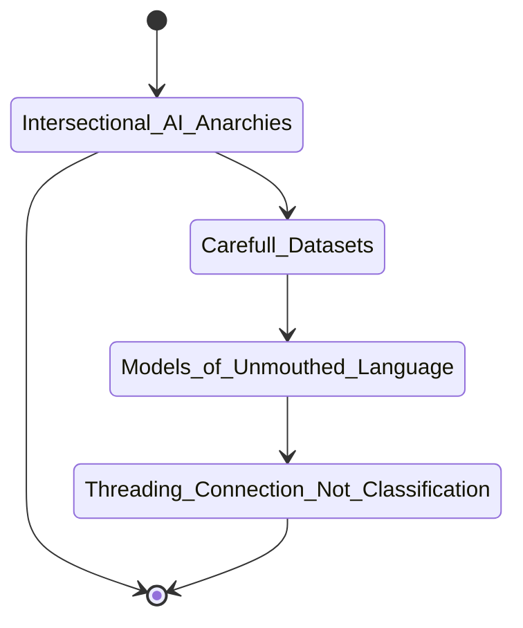



# {{ page.title }}

>"listening for 'poetry from the future,' without insisting that it be recognizable as such, is an ethical demand of and for our times." — Kara Keeling, 2019

>"What becomes possible when we are immersed in the queerness of forms of life that dominant systems cannot chart, reward or even understand?" -Alexis Pauline Gumbs, *Undrowned*, via *Meltionary*: "Ritual for Tending to the 'Not Perceivable'"

>"And his responsibility, which is also his joy and his strength and his life, is to defeat all labels and complicate all battles by insisting on the human riddle, to bear witness, as long as breath is in him, to that mighty, unnamable, transfiguring force [...]"
– James Baldwin

>"The database depends on the loss of the thing itself." -Tara McPherson, *Feminist in a Software Lab*

>"They say, the language you speak is made up of words that are killing you." —Monique Wittig


>"This queer model opens up new imaginaries and forgotten language beyond the confines of accurate prediction and effective generalization. We understand this type of machine learning as **replacing training with listening**. A listening which as Kara Keeling describes is a 'generative proposition another world is possible, the insistence that such a world already is here now and it listens, with others, for the poetry, poetry, the refrains, the rhythms, and the noise such a world is making'. (2019, ix)" — Winnie Soon, [Queer Motto API](https://gitlab.com/siusoon/queer-motto-api/)


## 0. Overview

Consisting of new datasets, new models, and new technical and artistic practices, this project lays out alternative approaches to text-based machine learning that center marginalized experiences. “A Queer Love Corpus,” is its pilot dataset for developing intersectional approaches to conscientious dataset stewardship.

## 🔥 what's the problem? 
## *Giant machine learning tools grab data indiscriminately*
### Despite their totalizing approach, they still do a terrible job telling stories about people who don't fit their normalizing baselines.  


| 74gb {: .stat-font } | 590gb {: .stat-font } | 825gb {: .stat-font } | 4.9Tb {: .stat-font } |
| **Common Voice** {: .caption }| **GPT-3** {: .caption }| **GPT-J/The Pile** {: .caption }| **WuDao 2.0** {: .caption } |
| 85,825 voices publicly contributed open source {: .caption } | scraped social media sites: reddit, twitter, github, etc. {: .caption } | Colossal Clean Crawled Corpus, open-source web-scraping bot, other datasets {: .caption } | 3 billion scraped Chinese websites, plus English academic & technical pages {: .caption } |

- The size of these models means they pull in racist text, inaccurate text, private text, and other kinds of problematic text.
- The size of these models prevents their review and adjustment. Furthermore, it is difficult to develop criteria by which they should be reviewed or adjusted, ostensibly because they are intended for "general" "all-purpose" tasks.
- The size of these models prevents many individuals from using them except as designed by large companies. Understanding, customizing, and using them in unique ways requires high technical expertise and financial overhead.
- The size of these models enacts a totalizing approach that—rather than representing a multitude of voices, centers, normalizes—and affirms a powerful status quo while leaving out the experiences of many others even as they capture our data.


<!-- >>Problem sentence<< -->

### The solution is NOT to suck up more data carelessly!

### So how do we address this care-fully?

>>Research question<<

Rather than ineffective solutions that superficially address bias by trying to "optimize" existing systems, and rather than dismissing their potential entirely, let's reimagine large language models and large-scale machine learning from their foundational principles in order to achieve different goals--such as curated, accessible, tangible tools suited to their users and caring for their subjects; tools designed to take into account their contexts and to incorporate intersectional values.


## why does this matter?

## who does it impact?

## how to address it?

## where are more details? 


#### 1.1.1 how it works now

**TRANSFORMERS**

When predicting what words will most likely follow the word '*bank*', should the ML system expect '*money*' or '*river*'? Depending on what texts have trained the model, if the system almost always expects *money*, the opportunities to encounter *rivers* disappear. 

This example comes from a tutorial on transformers [@rasaRasaAlgorithmWhiteboard2020](), a type of machine learning model commonly used for training with large language datasets for machine learning. It was presented as a neutral example, but it is instructive not only for describing the operation of these systems on a technical level but for showing how they pit economic value versus other values, such as ecology and poetics. Fredric Kaplan calls this "linguistic capitalism" [@kaplanLinguisticCapitalismAlgorithmic2014](), and describes how its technical mechanisms shrink the possibilities for what can be searched, spoken, and known.

Each moment where a decision is made to chose *money* over *river* is miniscule, a microgesture made by numerical weights. Individually, each can be reasoned away. But in aggregate, these decisions make huge impacts.

**SCALE & SCRAPING**

Whether curating a small collection, or scraping from the web indiscriminately, gathering and selecting sources for texts enacts the cultural standards of its creators. Selection presents a point of view. Acknowledging and accounting for this counteracts the pervasive assumption that the totalizing approaches of large language model datasets "neutralize" this issue, when in fact they highlight the Western, Educated, Industrialized, Rich, Democratic (WEIRD) culture from which they emerge. 

**ORIGINS & LEGACIES**

Models are built on top of other models, datasets are built as compendia of other datasets. In current industry practice, a new model's performance is measured by its adherence to standardized benchmark datasets. These originating, foundational tools often go unquestioned when building upon them. ChatGPT trains on top of GPT-3 and combines it with a new dataset of prompts. [XXXXX] trains on [XXXXXXX], which is trained on ImageNet. But what happens when ImageNet or the 

How the [XXX] Brown Corpus, etc. leads to WordNet leads to ImageNet ([Crawford 2021]()), how even when the "problematic" terms are removed, the system continues to operate in flawed ways


- It relies on flawed logics of bias and classification from its fundamental structures.
- It is is designed to operate without any one part. ([Amoore]())
- It persists/perpetuates and amplifies and creates the cultural systems. ([]())

>"This clustering of aesthetic information and stereotypes is at the heart of AI image generation systems. This is true whether we are asking for pictures of flowers (a generalization of all flowers) or butterflies (a generalization, a stereotype, of all butterflies.) But it raises unique questions about removing harmful representational biases. How do you remove real Sumatrans from Sumatraism? [...] We might say the “genre” of these style markers are haunted by images of similarly associated ideas. A category of information containing a set of harmless style effects can, it seems, contain residues of whatever those lingering tropes were used to depict." 
>>—Eryk Salvaggio, "How Midjourney Reads a Mugshot"

#### 1.1.2 how it could work


#### 1.1.2 CAREFUL CORPORA

#### 1.1.2 MODELS OF UNMOUTHED LANGUAGE

#### 1.1.2 THREADING CONNECTION NOT CLASSIFICATION

### 1.2 Goals

#### 1.2.1 Measures of Success

#### 1.2.2 Non-Goals

### 1.3 Steps

#### 1.2.0 Examine Existing Corpora

- Collect examples of large-scale datasets commonly used in machine learning tasks, studying their design and methods
- Develop search system for exploring an example dataset, using elasticsearch database tools and hosted NAS
- Develop list of keywords and concepts this project is interested in knowing how the example database handles
- Apply NLP techniques to analyze database contents, asking 

#### 1.2.1 Create New Corpora

- Collect recommendations for texts to include
- Get consent and permissions from authors for this use case
- Compile 
- Preprocess datasets conscientiously, following recommendations from Critical Field Guide to Working with Machine Learning Datasets and best practices for dataset stewardship
- Split into training, verification, and testing datasets
- Provide to select open-access communities for review and comment

### 1.2.2 "Train" New Models Using New Datasets

- Prompt programming with text from new dataset
- Fine-tuning existing models using new dataset
- Train from scratch to make a new model with the new dataset (using existing algorithm architectures)
- Create new model (or non-model, other paradigm) architecture by taking a new approach to processing the new dataset

### 1.2.3 Use the New Models 

Evaluate each of these new approaches to see how they impact the resulting outputs, by comparing them to existing models and each other using benchmark testing and different applications.

- Prompt programming
- Text generation, dialogue, analysis tasks
- User experience A/B testing with pre-existing models
- Artist co-writing and curating
- Poetics research: develop through experimental writing and gallery installation

### 1.2.4 Public Engagement

- Artist installation
- Community workshops
- Educational engagement
- Public distribution

## terms

### system

Rather than algorithm or model, I use (machine learning) system here to [XXX]

## 3.3. methods & methodologies

Anti-Racist Critical Code Studies
Queer Feminist Tactical Media (Raley)
QueerOS (Keeling), Queer Computation (Gaboury)
Ramon Amaro: *The Black Technical Object*


>"While we need not give up on the radical potential of queerness as a means of imagining a future that is not yet here (Muñoz 2009), we must nonetheless acknowledge how futurity has been colonized by the cultural logic of contemporary technology, and as such cannot serve as the primary vector for queer computational critique. Thus, rather than mobilize queerness as a useful technological apparatus, we might deploy it as part of a critical practice of unmaking." (Gaboury 2018, "Critical Unmaking: Towards a Queer Computation", 488)

>"I am meeting a socially generated problem of technological inadequacy with a critical, technical inadequacy of my own, answering their flaw with a counter-flaw of equal proportion. It’s a class aesthetic." (Triton Mobley, BOMB interview, 2022)

### 3.3.2 inspiration

- [critical engineering manifesto](https://criticalengineering.org/)
- []()

## 3.1 proposed solution

### 3.1.1 components

#### DATASET CONTENTS

- form, archives, scraping

#### DATASET DESIGN 

Many existing text corpuses, which are the datasets to train large language models for machine learning tasks (e.g. GPT-3/ChatGPT text generation), have very little information about the origins of their texts included either in their documentation or in the datasets themselves. For example, "The Pile" is a mega-dataset made of other already enormous datasets, designed for very large language model training. Its schema consists of two simple entries, the `text` itself and the `source` of the text. However, to call this a source is misleading, because the source field simply points back to the originating dataset, like [Common Crawl Corpus or Books2 or WebText](). These also giant datasets do not offer any more information about the journey this text took to arrive in this corpus, who authored it or when, what it might contain. 

As Tara McPherson says, "The database depends on the loss of the thing itself. At one level, this loss is literal, as the 'thing'—say a photo or film—is digitized and transformed into data. At another level, this loss is also a key aspect of the functioning of the technology." 

**No data cards** @gebruDatasheetsDatasets2020


**SAMPLE ENTRY FROM [THE PILE](https://huggingface.co/datasets/the_pile/viewer/all/train)**

```JSON
{ 
    "text": "Topic: reinvent midnight madness Amazon announced a new service at the AWS re:Invent Midnight Madness event. Amazon Sumerian is a solution that aims to make it easier for developers to build virtual reality, augmented reality, and 3D applications. It features a user friendly editor, which can be used to drag and drop 3D objects and characters into scenes. Amazon … continue reading",
    "meta": 
        { "pile_set_name": "Pile-CC" }
}
```

Many of the datasets which go into the larger Pile dataset do not themselves have separated metadata, each only has a text field or incidental information. 

**SAMPLE ENTRY FROM [COMMON CRAWL CORPUS](https://huggingface.co/datasets/snoop2head/common_crawl)**

```JSON
{
    "text": "The Marine Corps makes you buy the sword. That always bothered me. Eight hundred dollars for a fancy-looking but dull blade that I only used once for a sword arch at a buddy’s wedding. But, on Jan. 6, 2021, as I took my sword from its display case on the wall of my congressional office, it seemed like the most practical weapon with which I could defend myself, if it came to that."
}
```

**SAMPLE ENTRY FROM [BOOKS2](https://huggingface.co/datasets/the_pile_books3/viewer/plain_text/train)**

```JSON
{ 
    "title": "7 Secrets to an Awesome Marriage",
    "text": "" \nSome authors write about the \"latest secret\" to lasting love, but in this book Kim shares how "(...TRUNCATED)
}
```

**SAMPLE ENTRY FROM [OPENWEBTEXT2](https://openwebtext2.readthedocs.io/en/latest/)**

Some datasets do provide a bit more context for their source texts, such as OpenWebText2, which is an open-source recreation of the proprietary version used to develop GPT-2/3. We cannot assume that the closed version created by OpenAI has this context, and regardless it remains unavailable to researchers or members of the public. Below is an example of one of its 17 million entries, which includes additional fields like the source URL, title, subreddit it appears in, and Reddit "Karma Score" (which was used by OpenAI to filter for viable entries)(more on this in **Section 1.1.1**).  

```JSON
{
        "text": "A shutdown to contain the coronavirus has killed Thailand’s party scene and forced sex workers like Pim out of bars and onto desolate streets. She’s scared but desperately needs customers to pay her rent.\n\nRed-light districts from Bangkok to Pattaya have gone quiet with night clubs and massage parlors closed and tourists blocked from entering the country.\n\nThat has left an estimated 300,000 sex workers out of a job, pressing some onto the streets where the risks are sharpened by the pandemic.\n\n 
        (...TRUNCATED)
        "meta": {
            "title": "Scared but Desperate, Thai Sex Workers Forced to the Street",
            "lang": "en",
            "url": "https://www.breakingasia.com/trending/scared-but-desperate-thai-sex-workers-forced-to-the-street/",
            "word_count": 169,
            "elapsed": 3.9094655513763428,
            "scraper": "newspaper",
            "domain": "www.breakingasia.com",
            "reddit_ids": [
                960571968
            ],
            "reddit_scores": [
                10
            ],
            "reddit_titles": [
                "Scared but Desperate, Thai Sex Workers Forced to the Street"
            ],
            "subreddits": [
                "BreakingAsia"
            ],
            "reddit_created_utcs": [
                "2020-04-06T10:28:08"
            ]
        }
    }
```

Alternatively, here is a proposed entry for A Queer Love Corpus, with metadata and contextual fields for not only the source of the text data but also how it was contributed and processed, what permissions were provided, and why its contributor finds it relevant to the dataset. 

This approach combines curation practices from information sciences with dataset creation practices to better account for data donation and informed consent, traceable attribution, and granular control for custom datasets. It also allows the dataset to be used as an archive, explorable and extensible in its own right.

**PSEUDOCODE SCHEMA for *QUEER LOVE CORPUS***

```JSON
{
    "_id": 01234,
    "creator": "adrienne maree brown",
    "corpus": ["queer love corpus"],
    "datePublished": 2019,
    "dateAdded": "2022-02-02T02:17:25+00:00",
    "description": "This work is a compendium of self-pleasure and community care as a revolutionary call to arms, embracing expansive ideas of love for earth, for others, for body, for soul.",
    "format": "text/txt",
    "identifier": "brown_pleasure_activism.",
    "keywords": ["Black feminist", "activist", "sex", "desire", "love", "queer"],
    "language": ["English"],
    "length": 123456,
    "rights": "e.g. The publisher has granted permission for this work to be included here. See license for complete terms of use.",
    "preprocessBy": "Sarah Ciston",
    "preprocessNote": "e.g. converted from PDF to TXT using OCR, smart quotes removed, contributor texts without contributor permissions removed"
    "publisher": "AK Press",
    "sourceURL": "e.g. https://www.example.com",
    "submittedBy": "Sarah Ciston",
    "title": "Pleasure Activism: The Politics of Feeling Good",
    "type": ["non-fiction", "collection"]

}
```


**Contributor Roles**

- form for submissions
- multiplicity of perspectives, types of texts, types of content, definitions of what 'fits' this dataset

**Creator/Publisher Roles**

- providing customizable license for how the data will be used, able to be updated and revoked
- traceable back to the creator, not lost in the scrape
- informed consent for the particular way their data is being provided to others and potentially used

**Preprocessor/Data Scientist/Formatter Role**

- acknowledges the role of the person formatting the data to prepare it for inclusion in the dataset, both their labor and their impact on the information

TK:
- compare with and adapt library metadata standards where appropriate for fields that cross over and for citational json(?)


#### TOOLS, LIBRARIES

* scraping tools (TK ask emily): beautifulsoup, scrapy
* *pdftk-server* pdf toolkit for preprocessing for ocr, command line and gui [download here](https://www.pdflabs.com/tools/pdftk-the-pdf-toolkit/pdftk_server-2.02-mac_osx-10.11-setup.pkg) [manual](https://www.pdflabs.com/docs/pdftk-man-page/)
* *tesseract*: OCR PDF images to PDF text // *Abbey Fine Reader* licenses USC
* *[pdftotext](https://www.xpdfreader.com/pdftotext-man.html)* [tutorial](https://kenbenoit.net/how-to-batch-convert-pdf-files-to-text/(shell), or *PDFminer* (python), maybe *[ghostscript](https://ghostscript.readthedocs.io/en/gs10.0.0/Use.html#)*: PDF text to plaintext file, or
* json/parsing scripts (TK)
* *elasticsearch* database, set up with docker, vps or local rpi w nas
* *nlptk*/*spacy*: natural language processing, understanding
* which models (TK) for which tasks
    * [google flan-t5](https://huggingface.co/models?search=flan-t5)
* potentially *RASA* for bot

#### WORKFLOWS, TESTS

To do: Refactor all this as a single python script
1. command line: `pdftk $file burst` > `pypdftk`
2. convert folder of single page PDFs to PNGs w script `python '/Users/sarahciston/Desktop/lovecorpora/scripts/pdf2png.py'` (python/cl)
3. tesseract converstion with script `bash '/Users/sarahciston/Desktop/lovecorpora/scripts/img2ocr.sh'` run twice mb
    3a. to OCR text `tesseract $f $f` 
    3b. to OCR embedded pdf `tesseract $f $f pdf`
4. recombine files with script 
    4a. for text: `cat ./*.txt > $file.txt`
    4b. for zine pages: `pdftk ./*.pdf cat output $file.pdf` 
5. data preprocessing
    - remove hard breaks
    - remove gibberish (how?)
    - convert to json or leave as plain txt
6. add to corpora w metadata
    - licensing & rights
    - standardized librarian catalogue data import possible for ease-of-use & transferrability?


#### REFERENCES

* [ocr resources](https://github.com/kba/awesome-ocr)
* [libguide](https://libguides.usc.edu/contentmining/training)


<hr/>


#### TK in the design document 
0. overview (abstract)
1. what is the challenge
    - problem sentence, context
    - reframe as research question
2. why does it matter
    - benefits & harms
    - recommendations, solutions
3. how to approach it
    - proposed solution 
    - deliverables
    - goals, non-goals, success criteria
4. who does it impact, who can address it (user research)
    - user personas, journey maps. As a *type of user*, I want to *action*, so that *benefit*.
    - pain points & insights
    - contributors/collaborators
    - reviewers
5. details
    - about (design guidelines, technical architecture)
        - components (specs)
        - existing solution workflow
        - proposed workflow A/B comparison
        - pseudocode
        - prototypes lofi wireframes, hifi mockups
        - how-to instructions
        - alternatives considered
    - risks & resources
        - constraints & assumptions, dependencies
    - methodology & methods
        - ethos
        - inspirations
        - making tools
        - starting small
    - scope
        - steps
            - design
            - production
            - testing (model/user), monitoring, auditing, alerting
            - communication plan
        - timeline
        - milestones
        - budget
6. discussion & insights (+ conclusions, execution, recommendations, message/takeaway)
7. appendices: glossary, style guide, visual examples, code examples, updates




>"There is poetry in the stop list [...], a distillation of what is simultaneously most common and least telling." –Daniel Rosenberg, "Stop, Words"

>‘‘the ratio of human work to machine time was more than 100:1. Computer hours were less than 10,000 while man hours were much more than one million.’’ (Index Thomisticus, Index Thomisticus, via Rosenberg)


Whether used to create text-to-image models, like Stable Diffusion or Dalle-2, or Swiss Army knife language models, like Galactica, or whether wrapping them in conversational agents, like ChatGPT——the systems all rely on similar foundational models, datasets, and architectures that are designed with similar approaches and goals in mind. 

Problem: The giant datasets that train 
language models are becoming ubiquitous but we don't know the data that is inside them or how it impacts 

>"Selling or giving away the data invites western corporations to mine their language – and the thousands of years of traditional knowledge therein – for commercial opportunity, Jones says. It would mean entrusting data scientists with no connection to the language to develop the very tools that will shape the future of the language. And worst of all, it would mean that Māori would miss out on the economic opportunities created using the language that belongs to them, much like they didn’t see the economic benefits of the land that belonged to them."  (Nast, C. (2021, April 28). Māori are trying to save their language from Big Tech. Wired UK. https://www.wired.co.uk/article/maori-language-tech)

>"Once the images in a dataset have informed a model, it’s not referencing those images anymore. It draws from representations of the categories of that dataset, prompted by words. It isn’t “writing light” at all. It’s inscribing ontologies onto noise." - @salvaggioMostGeneratedBarn2023 (Salvaggio, E. (2023, January 8). The Most Generated Barn in America [Substack newsletter]. Cybernetic Forests. https://cyberneticforests.substack.com/p/the-most-generated-barn-in-america?publication_id=274498&isFreemail=true
)

>"reminds us not to look to the images but the structures that compose them: the systems that make the picture, rather than the light they produce" https://cyberneticforests.substack.com/p/the-most-generated-barn-in-america?utm_source=post-email-title&publication_id=274498&post_id=94453327&isFreemail=true&utm_medium=email

>"rsion of the historical page that is clustered and mutable, the scrapbooks remind us of the variability of historical ephemera and challenge our notions of the tidy authority of the archive. In both volume and diversity of subjects, the scrapbooks further draw attention to the multiplicity (and frequent indeterminacy) of potential narratives.

>"he used collage aesthetics to help forge a diverse collective identity across eclectic spheres of black America."

>"We are no more able to solve that problem for logic/probability/causality systems than we are for deep learning systems. We can have a node in our model labeled “tree”, but we are no more (or less) able to check that it actually robustly represents trees than we are for a given neuron in a neural network. Similarly, if we find that it does represent trees and we want to understand how/why the tree-representation works, all those labels are a distraction." ([Less Wrong, "Deep Learning Systems Are Not Less Interpretable Than Logic/Probability/Etc"](https://www.lesswrong.com/posts/gebzzEwn2TaA6rGkc/deep-learning-systems-are-not-less-interpretable-than-logic)

>"three modes of reading that can be engaged when studying datasets—a denotative reading (extrapolating the literal meaning of values in a dataset), a connotative reading (tracing the socio-political provenance of data semantics), and a deconstructive reading [of datasets] (seeking what gets Othered through data semantics and structure)." Poirier, 2021 @poirierReadingDatasetsStrategies2021a (this work, and that of mimi onuoha and others, does the deconstructive, but also reconstructive). 

