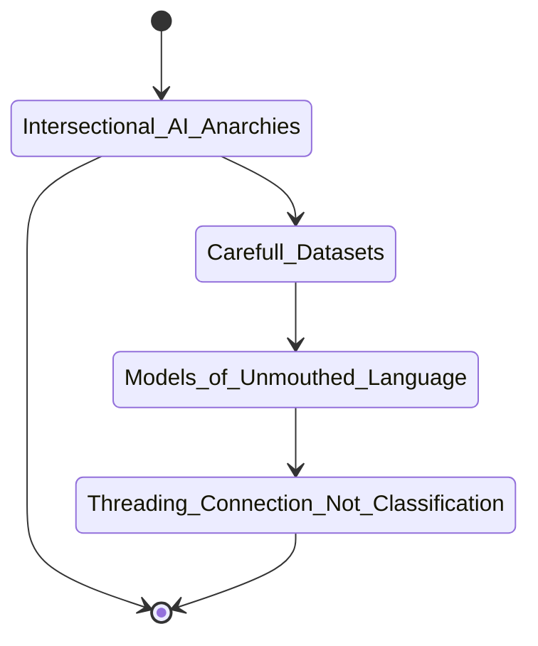



# {{ page.title }} | love corpora

>"What becomes possible when we are immersed in the queerness of forms of life that dominant systems cannot chart, reward or even understand?" -Alexis Pauline Gumbs, *Undrowned*, via *Meltionary*: "Ritual for Tending to the 'Not Perceivable'"

## 0. Overview

Consisting of new datasets like the queer love corpus, new models, and new art practices, this project lays out alternative approaches to text-based machine learning. 

## 🔥 what's the problem? 
## *Giant machine learning tools grab data indescriminately*
### But they still do a terrible job telling stories about people who don't fit their normalizing baseline.  


| 74gb {: .stat-font } | 590gb {: .stat-font } | 825gb {: .stat-font } | 4.9Tb {: .stat-font } |
| **Common Voice** {: .caption }| **GPT-3** {: .caption }| **GPT-J/The Pile** {: .caption }| **WuDao 2.0** {: .caption } |
| 84,673 voices publicly contributed open source {: .caption } | scraped social media sites: reddit, twitter, etc. {: .caption } | Colossal Clean Crawled Corpus, open-source web-scraping bot, other datasets {: .caption } | 3 billion scraped Chinese websites; plus English academic & technical pages {: .caption } |


<!-- >>Problem sentence<< -->


### The solution is NOT to suck up more data carelessly!

## 


### So how do we address this care-fully?
>>Research question<<

Rather than ineffective solutions that superficially address bias by trying to "optimize" existing systems, and rather than dismissing their potential entirely, is it possible to reimagine large language models and large-scale machine learning from their foundational principles in order to achieve different goals--such as curated, accessible, tangible tools suited to their users and caring for their subjects; tools designed to take into account their contexts and to incorporate intersectional values?


## why does this matter?

## who does it impact?

## how to address it?

## where are more details? 


How [XXX] leads to WordNet leads to ImageNet ([Crawford 2021]()), how even when the "problematic" terms are removed, the system continues to operate in flawed ways:
    - It relies on flawed logics of bias and classification from its fundamental structures.
    - It is is designed to operate without any one part. ([Amoore]())
    - It persists/perpetuates and amplifies and creates the cultural systems. ([]())
[Kaplan]()'s linguistic capitalism shrinking the possibilities for what can be searched, spoken, known. 

- The size of these models pulls in private text, racist text, and other kinds of problematic text.
- The way the choices are made about where to source text is based on cultural standards which center the status quo, "normalizing" to a status quo, leave out most of our voices, even as they capture our data.
- The size of these models prevents their review and adjustment.
- The size of these models prevents their use by individuals (technical and financial expertise required).


#### 1.1.1 how it works now

When predicting what words will most likely follow the word '*bank*', should the ML system expect '*money*' or '*river*'? Depending on what texts have trained the model, if the system almost always expects *money*, the chances for *rivers* will disappear. 

This example comes from a tutorial on transformers @rasaRasaAlgorithmWhiteboard2020 [Rasa](), a type of machine learning model commonly used for training with large language datasets for machine learning. It was presented as a neutral example, unwittingly pitting economic value versus ecology and poetry. 

Each moment where a decision is made to chose *money* over *river* is miniscule, a microgesture made by numerical weights. Each can on its face be reasoned away. But in aggregate, these decisions make huge impacts.

#### 1.1.2 how it could work


### 1.2 Goals

#### 1.1.1 CAREFUL CORPORA

#### 1.1.2 MODELS OF UNMOUTHED LANGUAGE

#### 1.1.3 THREADING CONNECTION NOT CLASSIFICATION

#### 1.2.2 Non-Goals and Measures of Success

### 1.3 Steps

#### 1.2.1 Create New Corpora

- Collect recommendations for texts to include
- Get consent and permissions from authors for this use case
- Compile 
- Preprocess datasets conscientiously, following recommendations from Critical Field Guide to Working with Machine Learning Datasets and best practices for dataset stewardship
- Split into training, verification, and testing datasets
- Provide to select open-access communities for review and comment

### 1.2.2 "Train" New Models Using New Datasets

- Prompt programming with text from new dataset
- Fine-tuning existing models using new dataset
- Train from scratch to make a new model with the new dataset (using existing algorithm architectures)
- Create new model (or non-model, other paradigm) architecture by taking a new approach to processing the new dataset

### 1.2.3 Use the New Models 

Evaluate each of these new approaches using new datasets impacts the resulting models, by comparing them to existing models and each other using benchmark testing and applications.

- Prompt programming
- Text generation, dialogue, analysis tasks
- Artist co-writing and curating
- User experience A/B testing with pre-existing models

### 1.2.4 Public Engagement

- Artist installation
- Community workshops
- Educational engagement
- Public distribution

## terms

### system

Rather than algorithm or model, I use (machine learning) system here to 

## 3.3. methods & methodologies

### 3.3.2 inspiration

- [critical engineering manifesto](https://criticalengineering.org/)
- []()

## 3.1 proposed solution

### 3.1.1 components

#### DATASET DESIGN 

Many existing text corpuses, which are the datasets to train large language models for machine learning tasks (e.g. GPT-3 text generation), have very little information about the origins of their texts included either in their documentation or in the datasets themselves. For example, "The Pile" is a mega-dataset made of other already enormous datasets, designed for very large language model training. Its schema consists of two simple entries, the `text` itself and the `source` of the text. However, to call this a source is misleading, because the source field simply points back to the originating dataset, like [Common Crawl Corpus or Books2 or WebText](). These also giant datasets do not offer any more information about the journey this text took to arrive in this corpus, who authored it or when, what it might contain. 

**SAMPLE ENTRY FROM [THE PILE](https://huggingface.co/datasets/the_pile/viewer/all/train)**

```JSON
{ 
    "text": "Topic: reinvent midnight madness Amazon announced a new service at the AWS re:Invent Midnight Madness event. Amazon Sumerian is a solution that aims to make it easier for developers to build virtual reality, augmented reality, and 3D applications. It features a user friendly editor, which can be used to drag and drop 3D objects and characters into scenes. Amazon … continue reading",
    "meta": 
        { "pile_set_name": "Pile-CC" }
}
```

The datasets which go into the Pile do not have separated metadata, each only has a text field. 

**SAMPLE ENTRY FROM [COMMON CRAWL CORPUS](https://huggingface.co/datasets/snoop2head/common_crawl)**

```JSON
{
    "text": "The Marine Corps makes you buy the sword. That always bothered me. Eight hundred dollars for a fancy-looking but dull blade that I only used once for a sword arch at a buddy’s wedding. But, on Jan. 6, 2021, as I took my sword from its display case on the wall of my congressional office, it seemed like the most practical weapon with which I could defend myself, if it came to that."
}
```

**SAMPLE ENTRY FROM [BOOKS2](https://huggingface.co/datasets/the_pile_books3/viewer/plain_text/train)**

```JSON
{ 
    "title": "7 Secrets to an Awesome Marriage",
    "text": "" \nSome authors write about the \"latest secret\" to lasting love, but in this book Kim shares how "(...TRUNCATED)
}
```

**PSEUDOCODE SCHEMA for *QUEER LOVE CORPUS***

```JSON
{ 
    "_id": 01234,
    "text": "[example] (complete text here)",
    "title": "Pleasure Activism: The Politics of Feeling Good",
    "author": "adrienne marie brown",
    "year": 2019,
    "language": "English",
    "copyrightType": "authorPermission",
    "copyrightText": "[example] The author has granted permission for this work to be included in the Love Corpora. See the license for complete terms of use.",
    "sourceName": "AK Press",
    "sourceURL": "https://[...]",
    "fileFormat": "txt",
    "charLength": 123456,
    "contributorName": "Sarah Ciston",
    "contributorNote": "This work is a compendium of self-pleasure and community care as a revolutionary call to arms, embracing expansive ideas of love for earth, for others, for body, for soul.",
    "preprocessorName": "Sarah Ciston",
    "preprocessorNote": "[example] converted from PDF to TXT using OCR, smart quotes removed, contributor texts without contributor permissions removed",
    "sub-corpus": "queer love corpus"
}
```

<hr/>


#### TK in the design document 
0. overview (abstract)
1. what is the challenge
    - problem sentence, context
    - reframe as research question
2. why does it matter
    - benefits & harms
    - recommendations, solutions
3. how to approach it
    - proposed solution 
    - deliverables
    - goals, non-goals, success criteria
4. who does it impact, who can address it (user research)
    - user personas, journey maps. As a *type of user*, I want to *action*, so that *benefit*.
    - pain points & insights
    - contributors/collaborators
    - reviewers
5. details
    - about (design guidelines, technical architecture)
        - components (specs)
        - existing solution workflow
        - proposed workflow A/B comparison
        - pseudocode
        - prototypes lofi wireframes, hifi mockups
        - how-to instructions
        - alternatives considered
    - risks & resources
        - constraints & assumptions, dependencies
    - methodology & methods
        - ethos
        - inspirations
        - making tools
        - starting small
    - scope
        - steps
            - design
            - production
            - testing (model/user), monitoring, auditing, alerting
            - communication plan
        - timeline
        - milestones
        - budget
6. discussion & insights (+ conclusions, execution, recommendations, message/takeaway)
7. appendices: glossary, style guide, visual examples, code examples, updates





>"That is why he is called a poet. And his responsibility, which is also his joy and his strength and his life, is to defeat all labels and complicate all battles by insisting on the human riddle, to bear witness, as long as breath is in him, to that mighty, unnamable, transfiguring force [...]"
– James Baldwin