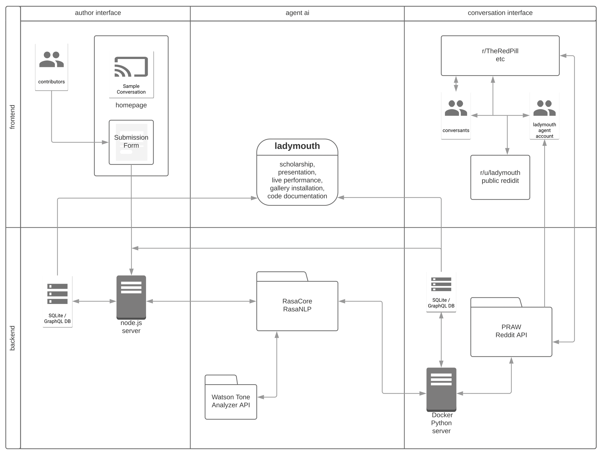
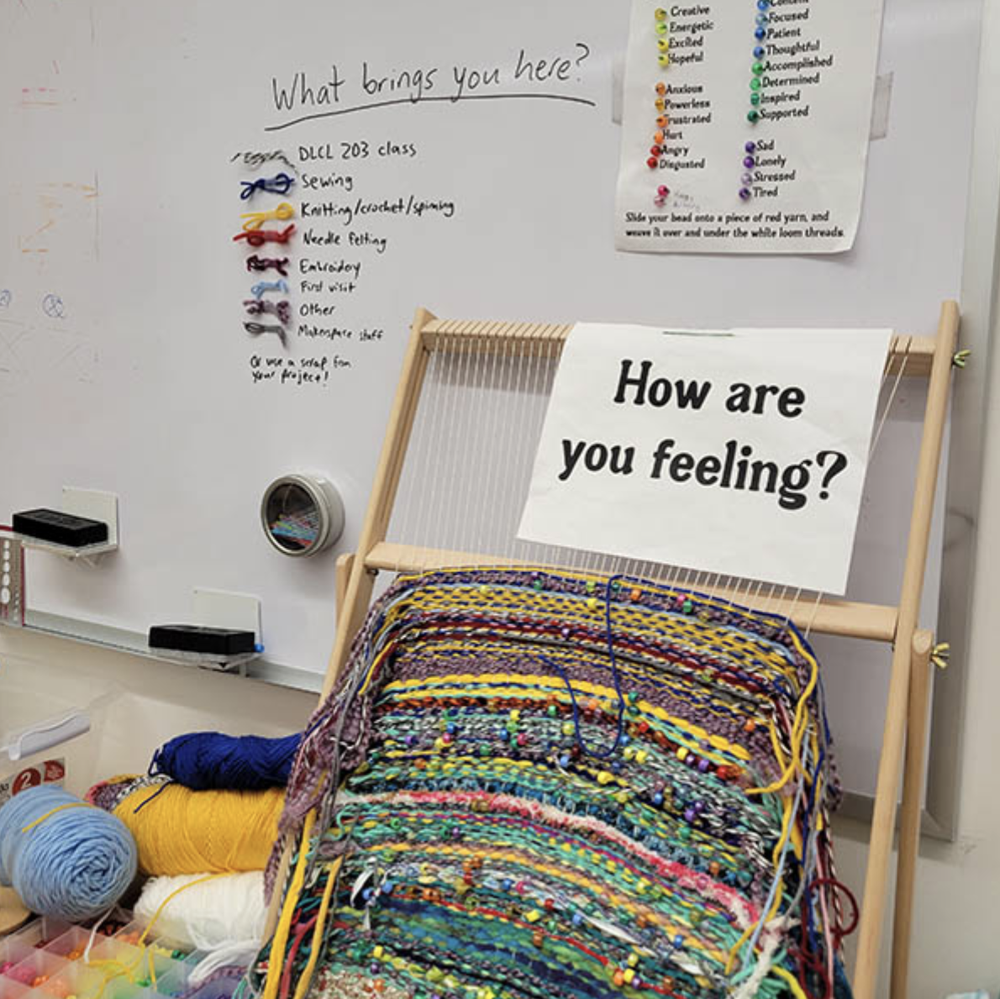

[//]: # "TK: JAVASCRIPT STARTER PACK *zettlekasten*"

# Coding Care: Field notes for making friends with code
{:.no_toc}

[//]: # "a pocket guide to making friends with code // field notes for friendly coding // friendly creative communities"

[//]: # "guide book / field notes / pocket guide"

* toclist
{:toc}

"Any meeting or gathering is a place to practice the future together in the most tangible ways."
{: .quote }

– adrienne maree brown
{: .quote .attrib }

## 0. Welcome 

[//]: # "hello world"

### Rough starts & disconnects

Have you considered learning to code but felt too intimidated to try? Have you struggled to program? Or don't know how to apply what you've learned to things you care about? 

[//]: # "or to understand how you'd actually use it?"

Maybe you're decent with programming skills but you'd still never consider yourself a 'coder'. *Coding Care* is about bridging this disconnect——the wide gulf between trying to learn coding and feeling empowered to create with code. 

[//]: # "(even though we likely interact with computation every day)."

"the prospect of a language that is both hidden and alien to me haunts my work on the net. Like most prejudices, it is born out of fear. I am afraid of what lies buried within the under text"
{: .quote }

–Jessica Loseby, "Code Scares Me"
{: .quote .attrib }

So many people feel left out of coding communities and spaces for learning about computation. But I believe it is essential for people who come from all different perspectives to share access to the digital languages which are altering the world and what it becomes. *I* want to live in a world that is shaped by *your* point of view and many others' point of views — not a world shaped only by one narrow take on what computers can be and do. 

"I was that convinced that I didn’t have the ability or technological talent to learn how to write code for something. I assumed that every person around me was miles ahead in their practice, and wondered how my passion for creative storytelling could really play into something so new and untouched." 
{: .quote }

–Tia Kemp, she/her, BA USC Media Arts + Practice
{: .quote .attrib }

### Don't stop me now

My own first experiences learning to code felt *awful*. Lonely. Discouraging. Confusing. I had the sense I was "supposed" to learn programming skills. It felt important, like I needed these tools in order to create the kind of art and language and world I imagined — but it also felt like an insurmountable chore. I had the sense everyone else could hack it but me: *Why was I the only one who didn't understand (or care!) about these dry, boring examples? Why was I getting lost in all the confusing, specialized vocabularies?* I felt thrown into a strange landscape——I lacked even the words to ask for what I needed, a basic knowledge of where to look, or an instinct for how to start. 

I wish I had known then that learning to code didn't have to feel like getting stuck. It didn't have to feel like I was fitting myself into someone else's stencil shape of a stereotypical engineer. I wish I had known that learning to code could feel like this:

Coding has helped me feel powerful and imaginative, sometimes even unstoppable. I learned (eventually, through trial and error)(and error and error) that coding can be fun — even playful, relaxed, welcoming. It can be creative, thoughtful, crafty. 

Once I accepted that the false starts and frustrations of learning to code are part of the process for *everyone*, that these don't make us 'not real coders', I began to push through these struggles more easily. Whenever I persist with coding, I find it rewards my effort with community connections, creative revelations, and more puzzling challenges. 

I have learned I can make coding my own, and that anyone else can too. This guide talks about how to nurture the supportive spaces that make this sparkly code feeling possible.

### (En)coding rituals: What are the practices of coding communities? 

Code is language and code is a tool for expressing and enacting combined. But coding has "belonged" to far too few for far too long, while the rest of us are considered outsiders to the encoded systems that consume us.

Current rituals and protocols around programming are stale: The stereotype of the hacker in a cave, clacking away at high speed as glyphs flash on a dark screen. The gray-hoodied employees playing ping pong in the office park, building rational white robots and ever-helpful femmebots. The black box that obscures machine learning's inner workings with hype, mysticism, and elitism.

This guidebook wants to enrich the rituals of programming to include the joy, community, and care necessary to make different kinds of code — and different kinds of worlds. It explores the practices of and in communities which are feeding new kinds of code and new kinds of coders that can [change the world]. [xxx]

[//]: # "politics of how magic rings here w its many connotations. within larger history of cybernetics, diff meanings and connotations. acknowledge, orient more toward"

[XXXmovedhere?][Seeing new community members who thought they hated code keep returning to our meetups — seeing them start referring to themselves as coders, seeing them share projects that express a distinctive critical voice — shows me the importance of open, welcoming communities that provide intersectional, interdisciplinary learning. And I’m starting to see the impacts such communities can have on [how we understand] algorithmic systems.]

### Code isn't magic, but we are

"No way, code is magic." 
{: .quote }

—Samir Ghosh, they/them, PhD student, UC Santa Cruz; former assistant director, USC Ahmanson Lab
{: .quote .attrib }

I believe in our power to reshape the world around us by experimenting wildly with the kinds of code, tools, aesthetics, and ethics we want to see. Although making a piece of code finally work certainly feels like magic, this so-called 'magic' does not come from men behind the curtains of big tech, hiding the keys while offering the hype of AI which says, "trust us, this this tech is too complicated for you" [or "if you only learned how to play the game our way."] Automated systems have always been deeply intertwined with humans in every way, from mechanical Turks to crowd labor outsourced to the Global South. No magic about it, just us. 

[XXXFIX][*I keep learning that this magic comes from us.*]

* How do we bring our [magic] to the systems we want to affect? 
* How do we change systems to suit us if we are stuck outside them – without conforming to their encoded ways of thinking? 
* How can we build communities that facilitate alternatives? 

These are the open questions explored by this guide — and explored every time we practice code-making in community.

### Code as collective: An open question

### aka What's in this pocket guide? What's a code collective and how do I get one?

Creative Code Collective is the community I started in early 2019 for media artists, activists, writers, makers, and not-yet-engineers to co-work, co-learn, and think critically with code in an inclusive, interdisciplinary space. I sent out a call, because I was looking for others who were struggling with code same as I was, and I hoped there might be another way — at the very least, we could struggle together. We launched with the mottos: `"Scrappy artistic strategies, not perfect code"` and `"We all have skills to teach each other."`

Throughout the guide I'll share what I've learned while building Code Collective — about coding, connecting, and building collectives. The guide honors and draws from the many mentors and teachers who have inspired it, gathering many resources found along the way. Of course the guide includes many reflections and contributions from community members — including coding examples and exercises, favorite projects and personal accounts — because this work is never done in isolation. I'll discuss connections I've found between coding and other crafts like zine publishing and fiber arts. I'll also discuss connections to open-source, open-access, and activist movements that shape the approach to how we gather and what we create. The guide is a melange of materials and methods, hopefully a spark of inspiration and the start of many conversations around these ideas. 

I am writing both as a representative of this community and also as an individual greatly influenced by it and by so many other creators, thinkers, and teachers. I want to document our work processes and thought processes, and to honor the many entangling threads that go into shaping a caring (coding) community. 

The heart of this book are ten principles that have emerged through gathering as Code Collective. They are simple tactics for anyone to employ in their own community practices — or adapt to suit them. Developing these tactics has been intuitive, iterative, and collaborative. They emerged out of desire and instinct. We have expanded and distilled these tactics influenced by other organizations, thinkers, makers, and more; and we have reshaped them continually as our group evolves. All recommendations in the book are intended to be descriptive, not prescriptive. Here's what has worked for us (and what hasn't). I invite you to embrace and adapt what works for you and leave the rest. And I am interested in how these tactics change in different circumstances, so if you find something that works better for you, I'd be excited to learn about it too! 

Each of the guiding principles is paired with sections called `PLAY ALONG` – practical exercises you can try — and `LIVE CODE` — brief case studies from other communities of practice. Although Coding Care is a pocket guide, it also lives in large part online as a [`PROJECT SHOWCASE`](https://creativecodecollective.com/showcase) of active works by Code Collective Community members and as a vibrant [`RESOURCE HUB`](https://creativecodecollective.com/resource-hub), a database of tutorials, textbooks, projects, code libraries, zines, and all manner of things we have found useful.

"Any meeting or gathering is a place to practice the future together in the most tangible ways" 
{: .quote } 

–adrienne maree brown [-@brownEmergentStrategy2017]
{: .quote .attrib }

Many of the things we do to sustain supportive communities seem too obvious to mention——or even worse, too obvious to notice — such that they aren't obvious *at all*. This guide is meant to remind me that these approaches matter, and to acknowledge how much they have supported me and others along the way. This guide celebrates those ephemeral things that make our caring coding community go. *It tries to describe our intuitive wayfinding about how to learn and teach and explore and be together, especially in and through the very things that both draw us in and also scare us, the things that feel both challenging and fun, frustrating and rewarding.*

It is not one gesture or one moment, but their accumulation. Each thing we have done intentionally, and unintentionally, adds up to *us*. To collect, to gather, to hoard like magpies. To embrace fascination with the shiny objects even when we don't yet know their purpose. To trust their meaning in our gut. To trust connections with other people. To rely on each other, to reconnect again and again, over the smallest things. To be vulnerable in shared struggle, shared silliness, shared delight. 

### Man(ifest)ual (manualifesto) & what this pocket guide isn't

This guide is not a manifesto, as much as I love a manifesto. Johanna Hedva says, "a manifesto is only ever a document that reaches too far, that speculates too impossibly, and that the only use a manifesto can have is to lay bare why it cannot be manifested, to open itself to all the ways its un-manifestation shapes the world"[@hedvaWhyItTaking] – yet here I document what we've actually put in the world, alongside what we hope to. Code Collective exists because I believe it is incredibly easy to have communities like this, and I am not the only one. Like code itself, and Code Collective, this guide strives to bring the "impossible" into the "real world" now – as a proposition toward how it can be entirely possible, present, liveable, and thriving. Anarchists call this "prefiguration" but we can just call it fun. And so the pocket guide exists somewhere between a manifesto and a manual. Make of it what you will; I hope you do!

[Back to top](#top)

## 1. We create who we are together

"What I like about code collective is that it's a community of friends as well as resources. That's where I can feel like we're all going on a journey of learning and discovery together."
{: .quote }

–Katherine Yang, she/her, BA Media Arts + Practice, Minor Linguistics, Minor Computer Science, USC
{: .quote .attrib }

Code Collective is a self-organizing community of artists, makers, students, people from all backgrounds——especially including those who have not done much or any coding before. We meet regularly to develop our programming practices in a flexible, co-working, co-learning setting.

We are artists, activists, first-gen students, never-ever coders, computer science majors, writers, dancers, linguists, neuroscientists, trans kids, queer folks, refugees, parents, staff and teachers, independent learners. We come from all career stages and from all levels of expertise. We come from many cultures, sexualities, classes, and genders. Many of us do not come to programming from a STEM-education pipeline (but some do). Our interests exceed the bounds of what our specializations offer and what our vocabularies describe. We all find different ways into code and community.

I started organizing the collective as an intervention. I craved a space where I felt welcome and free to explore without constraint, after experiencing how programming cultures had intimidated me and after witnessing how they had discouraged so many others. I noticed the need for supportive spaces that could value diverse capacities to learn. After my own struggles learning to code, and after a few joyful experiences that showed me it could be otherwise, I wanted to make space for anyone else struggling to find their fit, anyone convinced there was no place for them in the existing systems. 

Code Collective was necessary for me because I kept having the experience elsewhere that no one could understand what I was trying to make or do. I felt like I was not making sense – and certainly I was not sure myself – but some glimmer or gut feeling kept pulling me toward tinkering even though I was hitting walls, getting frustrated, hearing that it shouldn't or couldn't be done. Now I remind new visitors to Code Collective: *If you have an inkling (or a fear) that coding might be for you, it probably is. Welcome.* [^queerfeeling]

[^queerfeeling]: In this way, coding is like queerness: If you wonder if you're queer enough, you are!

### Start anywhere 

Upon gathering, I ask myself: What does this particular cluster of beings need and want from this gathering? What do we stand for? We get to define it and redefine it for ourselves. At our first meeting in January 2019, attendees cited a mix of desires for joining what would become Code Collective:

* "to learn what [programming] language is used for what"
* "not to be intimidated to try something new"
* "see what others do, have a set time to work on projects and keep skills sharp"
* "not to check the assigned boxes but find an artistic approach. make stuff"
* "ask questions"
* "see others projects and help"
* "see weird projects and find interesting solutions"
* "have an accountability space and a brain trust with shared expertise"
* "conquer my trouble starting and finishing. bounce ideas off of others. build something I'm proud of"

"For me, I could figure out how to code but I didn't really know what to use for what, for the specific things I like. Also part of the issues here is there's so many things you could do, right? [For the things I do, three.js is perfect. Once I figured that out, I didn't need to find other things. For someone who doesn't know how to code, give them a tool where they can learn to do a lot so they can figure out what tools they need — like p5.js.]"
{: .quote }

–Ada Toydemir, they/them, MS Computer Science, USC
{: .quote .attrib }

To explore how we might best create community, I asked each person to share what they were currently working on, some topics they knew about, some topics they wanted to know about. The goal here is to look for overlaps: Where do what you know about and what I want to know about intersect? Here lies magic!

As time goes on, our needs change, and our formats and structures keep pace. We have moved from conversations about possible group projects, mission statements, and organizational concerns toward a more freeform agenda, toward a blend of form and freedom that holds space for anyone's individual projects and needs during that meeting time.

### Be works-in-progress 

When beginning the collective, I described its focus as project-based learning, but later refined this to mean more process-oriented than task-oriented work. 

The group remains self-directed toward what its members want to make, and the process they take to make it, instead of requiring they absorb a pre-determined curriculum or complete particular objectives. Our conversations focus more on what you are learning along the way, how you are using the tools you found, how your technical choices are shaping your critical thinking, and how did your critical thinking is shaping your technical choices and tools, reciprocally and iteratively. 

When we "value process as much as, or more than, outcomes"[^amb], when we maintain a "beginner's mind" approach no matter what stage of that process, we can stay dynamic and we can acknowledge imperfection and ongoingness. I find this helps relinquish perceived requirements and impossible goals. 

This guide is also a work in progress. The guide shows its rough edges before it is ready. It has been drafted from scratch on a public website, built using Github, which displays its code repository and version tracking. This means that every past version of the text is available to view. Readers can compare differences in the history ([for example](https://github.com/sarahciston/codingcare/commit/5e1ef814d661f43027e3d0f15b5ba87415194cfe?diff=unified)) line by line and comment on the text as it changes. This laid-bare writing process enacts the Code Collective value **growth, not perfection**, which is mostly a reminder for myself. Working this way is a practice of vulnerability and an invitation for conversation. 

### Build it together, expand definitions

There are so many different outcomes and approaches possible for any technical challenge. By spending time with others, especially with different perspectives, we get to see how they might approach the same problem vastly differently. Even with the exact same concept, one person might implement it through a commercial product while another might implement it as an expressive artwork.

Working among others helps us continually question and expand our definitions. Along the way, you could each tackle similar troubleshooting issues in lines of code, but perhaps you would answer the questions that arise very differently based on your own goals. It helps to expand the spectrum of what one could make or invent, as a way to get out of our default modes and expectations for ourselves.

Designing the online presence for Code Collective has been an ongoing collaboration. Through the (perhaps menial but important) work of creating a seemingly simple site, we had to confront and create our collective identity very practically. We get to decide the tone of who we are as a group, how we will present ourselves, and to which publics: How do we describe what we are doing, what we prioritize, what we call ourselves, how we explain our processes, how we support others who join? What format do we put this in? What language do we use? Who do we make sure is included in this process?

Through this process of communication and collaboration among the group members about who we are and what we want to offer, the Code Collective website has expanded from a static landing page into a unique resource hub and project showcase – with a searchable, contributable database of tools, tutorials, research, and projects we have found useful. 

"The most challenging part of programming is conceptualizing the problem, and many errors in programming are conceptual errors."
{: .quote }

–[@mcconnellCodeComplete2004]
{: .quote .attrib }

### PLAY ALONG: TBD

[Back to top](#top)

## 2. We get scrappy

Code Collective endorses **scrappy artistic strategies, not perfect code**. We love your spaghetti code, your half-finished thought, your sketchy mindmap — just as much as we love the polished work it may one day be. When someone joins up wanting to try something new, we don't say, "That's not what code is for." Instead we're excited to discover yet another thing code can be for and how we can help them figure it out. 

We echo the call from the P5.js community statement, which warns against "code snobs" and assuming or prioritizing types of knowledge.[^p5] There is no programming language empirically better than any other; there's only the right tool for a particular task, for a particular person, at a particular point in time. It's totally fine to rely on code libraries and examples and the wisdom of those who came before you. Who doesn't!? We will always be reliant on collected and collective knowledge. 

Don't wait until you know you'll do it "perfectly" (or read the whole book, or taken the whole course) before you get started. Half the fun is in adapting unexpected outcomes into your process. Making and learning are reciprocal activities, a mobius strip of embodied knowledge. 

### Don't be afraid to break stuff (you can't *really* break it)

How do you start getting scrappy instead of studious? Break things! Or at least, don't be afraid to. The [TinkerTank](https://tinkertank.de/) mobile makerspace in Germany starts each of their workshops by selecting a piece of old electronics from their scrap pile — and completely dismantling it. "People are afraid to break things," workshop leader Johannes May told me, and this helps warm people up to build new, imaginative things from the broken parts. 

Too often I don't get started because I don't know where to start, and also because I am afraid to "mess up" what already exists. That's what backups and save-as and sketches are for. You can't (irrevocably) break anything, in all likelihood. And in the process of tinkering (which is just breaking with flair) you learn a lot![^tinker] So try to push through the fear of breaking something, or doing something "wrong," to make space for doing something "weird" aka interesting. So, knowing that you can't really break it, get cracking!

[^tinker]: To tinker is also to mend, to patch up, repair, or improve in a makeshift way [OED]. The word derives in part from the tasks of metalworkers (per Miller Puckette & OED). 

I learned to use scrappy artistic strategies from my first computational arts teacher, [Brett Stalbaum](https://visarts.ucsd.edu/people/faculty/brett-stalbaum.html). I was a poet who wanted to make weird books, and he told me simply, "Pick something small you want to try to make, and use that to begin learning Python." Reader—I was *terrified*. I had been making tiny GIF poems and had tried and failed repeatedly to teach myself some HTML, CSS, and Javascript. But none of it would stick. Still, I trusted Brett, so I found a little example code for a simple chatbot and used it to make what would become "ladymouth" — a bot that tries to explain feminism to misogynists online. Along the way, I learned enough about Python and SQLite and Raspberry Pi and toxic Reddit forums to make it run, even though I started with zero vocabulary and knowledge about relational databases or APIs or anything else. Through Brett's positive encouragement, and by finding the right tools for the job (Python was the language that made sense to me when other languages didn't), I slowly overcame my belief that I wasn't a coder, that I couldn't understand the tools I wanted to use, and that I didn't belong in the spaces that interested me (or that I didn't even know about). Being among others who were experimenting in these same ways taught me it was okay not to have all the pieces in place right away. [xxxmaybemove] 

### Critical breaking

*See also [Critical tinkering](#Critical-tinkering)*

If something exists, ask how it does. Ask if it should. Reverse engineer it. Run it backward. Learn from others' tutorials. Combine them. Modify them liberally. Pull from everywhere and remix wildly. Cite generously.

This is part of what we mean by scrappy — thoughtfully or playfully experimenting with the properties and limits of your materials, whether those materials are strings of wool or strings of code. This kind of "breaking" things is an essential artistic practice, and it looks different in every situation. It can range from off-the-cuff experimentation – "What happens if I push this?" — to full-fledged tactical media artworks that operate by digital civil disobedience – like the collective Electronic Disturbance Theater, which created tools to shut down government websites by pinging them repeatedly (called "distributed denial of service").[cite] For my past projects, this has ranged from diving into technology spaces I dislike (Reddit forums), tinkering with combining wildly different APIs[^api], and putting poetry into machine learning systems meant for corporate use. 

Critically breaking things helps us understand how they work (or don't work) from inside. It lets us understand some of the why behind their operations, the decisions that went into making them. Who are they made for? And with what goals? Who are they not made for and who do they not serve? It helps us think about how we might make them differently. I break stuff to see if its not-working can create some poetry, some community, some other way to engage with value than its original (likely capitalist) purpose. [^htmlEnergy][XXX]

Maybe all this tinkering doesn't feel "important" or "relevant" enough? Don't worry about that yet. Tinkering is a transferrable, lifelong skill:

"If you can teach students how to break one part critically, then they can go off and break other parts on their own in their career. 
{: .quote }

—Samir Ghosh, they/them, PhD student, UC Santa Cruz; former assistant director, USC Ahmanson Lab
{: .quote .attrib }

### PLAY ALONG: Break this code

One of the best ways to get started with learning a new aspect of programming is to take someone else's example code and learn how it's working by changing things — just little things to start. What happens if I make this a different color or run it at a different speed? How does it show up on screen? Then break big things — use it for different purposes, combine it with other code. 

Find some example code for a website you like by right clicking on any part of it in your web browser and hitting `Inspect`. 

You should see some windows appear that show the HTML and CSS source code for the site, where you can temporarily and without fear modify the site as you wish. Give yourself a fun mini challenge. The HTML puts items on the screen. The CSS styles those items in different shapes, colors, fonts. 

For example: What if a national newspaper had a purple background? Or a different headline. 

* Pick an aspect of the page you'd like to change, like the background and right click on it. 
* Go to the CSS area that opened when you hit inspect. When you hover over the section with your mouse, checkboxes will appear next to terms like `margin` and `padding` and `font`, for example.  
* Find `background` or `background-color:` and change what follows it to say `purple`. 

How about a different headline?

* Try right clicking on a headline you'd like to change and hitting inspect again. 
* Find the HTML panel that opened when you hit inspect. Depending on your browser, it's usually on the left by default, maybe on top. You should see the specific line of HTML that created the headline you see in your browser.
* If you change the text of the headline in the HTML, it will also change in your browser. Try it!

What other experiments with CSS and HTML might you try? What can you learn using this method about how the site you chose was built? 

This is a very aesthetic and web-based example, but you can imagine taking this approach to any tutorial or example you see. 

Retype it, learn how it works, break it for fun or for your own purposes.

### Build stuff

Breaking stuff beautifully leads to building new stuff. 

Build something to prove to yourself that it can exist or it should. 

Build it as an offering for others. 

Build something to show that building is for anyone. These objects are instruction manuals for hope. 

When the tool you need for building doesn't exist, build that too. Make it from existing tools you scrapped for parts. 

When you don't know the programming language you need for what you're building, trust you can pick up just enough of it to get by along the way. Write it out on paper if you don't know how to build it with code. Show it to a friend who can point you in a new direction. 

Find an example that looks enough like what you imagine to extrapolate. When you can't find a tutorial, don't assume it can't be done. Don't assume it isn't meant to be done. This means you might be the one to do it. 

Try asking with new language, asking a friend with a different background, asking with hands in the dirt, asking while tinkering on another project in another medium, asking while doodling or napping. Take breaks, but keep asking until answers circle back. Write it out on paper, draw it, sing it, dance it out. 

*Persistence is a rhythm not a slog.*

### LIVE CODE: Go slow, be of service

I have learned from many communities building transfeminist infrastructures that slow and embodied and connected "art that surfaces the hitherto invisible labor of service, care, and maintenance" has a place in coding communities as both a practical tool and a critique of institutions.[^Kleesattel] By modeling slower, more communal practices around these essential services, community and transfeminist server networks and collectives like Constant, Lurk, Rosa, [Systerserver](https://systerserver.net/), [varia](https://vvvvvvaria.org/en/pages/about.html)[XXXmakelinks], and others [XXX add Argentine servers] show how the maintenance of tools and materials (whether for internet services or any mutual aid) are essential forms of labor that can express power differently [XXXexplain/unpack?]. They can be careful and caring, or they can be consolidating and constrictive. They ask us to think about the precarious bodies (individual and connected) that rely on them. "A Wishlist for Trans\*feminist Servers" (continuously updated and retitled since 2014), lays out some of the objectives of this kind of caring codework. Trans\*feminist Servers...

>"... radically question the conditions for serving and service; they experiment with changing client-server, user-device and guest-host-ghost relations where they can. Who is serving whom? Who is serving what? What is serving whom? Are they being served?"

>"... do not serve every body; they continuously re-negotiate what counts as accessible. They respond to the fluctuating abilities, embodied knowledges and genealogies of their care-takers and users."

>"... reject generalized definitions of efficiency, efficacy, ease-of-use, transparency, scalability, accessibility, inclusion, optimization and immediacy because they are often traps."

>>– ["A Wishlist for Trans\*Feminist Servers"](https://www.bakonline.org/prospections/a-wishlist-for-transfeminist-servers/) @WishlistTransFeminist

[^Kleesattel]: Kleesattel, Ines. 2021. "Situated Aesthetics for Relational Critique: On Messy Entanglements from Maintenance Art to Feminist Server Art." in Aesthetics of the Commons. Eds Cornelia Sollfrank, Felix Stalder, and Susha Niederberger. @sollfrankAestheticsCommons2021

Read more at [A Traversal Network of Feminist Servers](https://vvvvvvaria.org/en/atnofs-publication.html) @TraversalNetworkFeminista 

### Get sticky, listen to materials

I joke that my projects are held together with duct tape and spitballs, but it's basically true. Most of them use a wild-sourced daisy chain of APIs[^api] and random tools from different domains, because this is what it requires to sketch out an idea I haven't seen represented elsewhere. There is magic and politics and new knowledge to be found in creative (read: unintended, inappropriate) applications and combinations of existing tools. 

[^api]: APIs are the access points for the code you write to reach different services and tools online. API stands for Application Program Interface. In the same way a web interface (browser protocol) helps a human reach a website by giving it structure, an API tells your code what constraints it needs to reach that site using programming. Like ordering from a menu, an API tells the programmer what they can order and how to request the information they need. When coders use APIs, they're pulling data or tools into their program from the outside — for example the [National Weather Service](https://www.weather.gov/documentation/services-web-api) — on top of the code they have written themselves. The downside of relying on external APIs is of course when one link in the chain breaks, when a company gets bought by a bigger one and shuts down its open source access, or updates their system... your code also breaks. (Hence the duct tape.)$$

To think about how to combine ingredients to produce new flavors, connect dots, (mix metaphors) is an explicitly artistic approach, because it is a way of thinking with (and against) materials *as such*. It questions and engages the material properties of the platforms, codes, cultures, data, and infrastructures, in the same ways artists explore other materials — whether paint color, wood grain, fiber textures, or anything else. Listening to your materials can make work self-reflexive in incredibly useful and critical ways, whether you decide to work with or against their attributes. 

One way to combine wildly is to work wildly with metaphors, as Ren Loren Britton and Helen V. Pritchard do when they unpack the acronym CS to expand the field of "computer science" to include "Chance and Scandal," "Crying Sabotage," "Careful Slugs," and more. They suggest this "promiscuous metaphorical practice" can open up different plans, questions, and techniques in the field – including considerations of crip-technoscience and of more-than-human world:  

"We follow CS (Careful Slugs) in how it might reroute, chomp away, do nothing about, slime up, slow down, or ripple towards attachments as a way of accounting for, unsettling, taking responsibility for, and remaking dominant universalisms of CS (Computer Science). We propose that when computation is approached through the speculation of CS (Careful Slugs), the computational operations of sorting become slowed down, separating becomes impossible as sticky bodies stick to surfaces, categorizing becomes softened."
{: .quote }

–Ren Loren Britton and Helen V. Pritchard (2022) [@brittonCarefulSlugsCaring2022a]
{: .quote .attrib }

It matters what materials you use and what metaphors you think with, whether your projects are held together with spitballs or slug trails.

### Learn how to learn

The goal is "growth not perfection." You will never get to "the end" where you have learned the entirety of a programming language. There will always be more to learn. Rather, the goal is to learn how to learn - to learn how to find the language to describe the questions you want to ask. With this skill alone, you already have all the tools you need to find the tools you need, all the skills you need to learn the skills you need — to make or do anything at all, eventually. 

How do we learn how to learn? We tinker and stretch a bit — whether in breadth or depth or both. We work from the foundations of what we already know and use it as metaphors to help us understand what we don't yet know. We question the foundations of what we already know and use new information to reflect on it in new contexts. We collage and combine and experiment with what might go together unexpectedly, what we might have taken for granted right in front of us. How did you learn the things you most enjoy? Was it from a text book or from your own explorations? What kinds of exploratory approaches work best for you? 

"For me, I could figure out how to code but I didn't really know what to use for what, and for the specific things I like. Also part of the issues here is there's so many things you could do, right?"
{: .quote }

–Ada Toydemir, they/them, MS Computer Science, USC
{: .quote .attrib }

[Back to top](#top)

## 3. We get vulnerable

### Plan to unplan, plan to be awkward

"I do not expect students to take any risks that I would not take, to share in any way that I would not share."
{: .quote }

–bell hooks [–@hooksTeachingTransgressEducation1994]
{: .quote .attrib }

Even, and especially, as leaders and teachers we must get vulnerable about our craft. Our bravery makes space for others to be brave. We can connect with each other around areas of concern, taking comfort that someone else has already worried the very same thing. Rather than showing a veneer of know-it-all authority (which is often quite thin), sets up both a one-directional hierarchy of exchange and an impossible standard for students other community members to meet. It shows them a person who "already knows" but it doesn't show them how to get there. 

I am continually finding that my presence in learning spaces as a vulnerable, uncertain, artistic queer body — who nevertheless creates — does much more to teach and model how to create than anything I actually have said in a lecture. All the other suggestions that follow were possible because I modeled them first. I said, "I don't know either, let's figure it out together." 

The socially awkward planner in me wants to know in advance what's going to happen in every session. But the less I plan and structure, and instead gesture and invite, the more space exists for group needs and wants as they arise. Some of my favorite teachers have whole slide decks I've seen them chuck out the moment the class discussion went another direction. I never understood that before, because I wanted to suck all that knowledge out of my teachers' heads. Now that I'm teaching, I get it. I'm more interested in what my students want to know than what I have to say. And when they share what they want to know, I can trust I'll have something to offer that can enrich, support, or connect with that instead. 

Your milage may vary, as mine has! I want to acknowledge that some folks are given much more leeway to display uncertainty while retaining their authority and respect than others are. I understand that your vulnerability will have boundaries and capacity limits, as mine does.[^identity1][^identity2]

[^identity1]: e.g. It looks very different for a white male professor with job security to engage "casually" or "flexibly" and still receive the benefit of the doubt when up for review. I want to use the privilege I have as a white person who has learned to "speak academic" (in the contexts where I must) to turn that voice off where I can and dismantle those structures as much as I can. I still worry about how I am perceived as "too feely" or "too feminine" or "too casual" in my non-binary queer femme graduate student instability. But however possible, I want to make it more comfortable for folks like me — and folks unlike me who may be even more precarious in academic or technologist spaces — to have a home here too. That doesn't happen without those of us who have the capacity to shut off the gatekeeping rhetoric doing so.

[^identity2] Briana Bettin (Assistant Professor of Computer Science and Cognitive and Learning Sciences, Michigan Tech) echoes this sentiment: "I let students see me make mistakes; I thank them for identifying those mistakes and engaging with the lecture. I ask them why that was a mistake and create conversation because students need to see experts fail too. Failure is part of learning, part of life and part of moving forward. As a young female instructor, failing in front of students can easily backfire. There have certainly been indications that this confirmed to some that I have no idea what I’m doing and that I’m not qualified. Despite that, I will continue to fail in front of my students and call myself out on it, because it makes the classroom a place they know they can try, fail and grow. If I can have a code failure in front of 200 of them and I’m supposed to know what I’m doing, they can fail in front of their lab partner or their roommate while they’re taking their first class." 

### Ask "stupid" questions (psst.. there are no stupid questions)

Try voicing your "stupid" questions, nagging suspicions, and fears.

Without fail, when someone bravely asks what they call a "stupid" question, it is a question others have too. Or it's a question they've been taking for granted and haven't considered before. Usually it requires even those who think they already know the answer to think more deeply about the question in order to answer it in plain language. 

So-called stupid questions help us all unpack what we consider assumed knowledge. Frequently, assumed knowledge points to the foundations of a field of study and how its histories are told through lenses of white supremacy, misogyny, colonialism, and ableism. We should all be asking these questions to understand our work and our contexts through new lenses. In this way, the "beginner" in the room makes one of the largest contributions to everyone's co-learning experience. 

### Troubleshoot together

"Just talking through your problems with somebody else always helps you get a better understanding what you're trying to do. But then also, other people will have different perspectives. Also just having that space to work through it together, having the time to sit down and be like, 'Okay, step one step two. Let me write these lines of code.' And then getting to different steps and going on the journey together. I feel like that's a really rewarding process that we go through." 
{: .quote }

–Katherine Yang, she/her, BA Media Arts + Practice, Minor Linguistics, Minor Computer Science, USC
{: .quote .attrib }

Sharing our struggles helps us solve them. In Code Collective, we do a lot of team troubleshooting, in which several folks gather around a screen to explore a project. Several things happen when we join together this way, and none require the participants to have expertise on the specific issue at hand. 

- First, simply explaining the problem to another person (or inanimate object, called "rubber ducking" in programming communities) can have the effect of helping you think it through in a new way for yourself. 
- Second, your partners might see something you don't see: Even if they have never used this language before or worked in this kind of task, they might approach the issue in a different way. 
- Third, if no one else sees how to approach the issue, they might know someone who does or have heard about a tool that could help.

### Make mistakes in public / ~~Accept~~ Highlight your mistakes

"highlight mistakes just as much as successes, rather than hide them. it is important for people who are new to programming to see people making mistakes, if they think everything works first time they will think they are not good enough and give up." 
{: .quote }

–annatito, Critical Code Studies Working Group 2022@titoWeekP5Js2022
{: .quote .attrib }

**Highlighting** mistakes is not about focusing on the negative; it brings our problems out of the shadows and removes the shame. Our mistakes connect us with each other. They show us we're not the first to encounter this issue,[^first] and they also show us we're not alone with the experience of facing coding challenges. Being vulnerable makes us stronger and brings us closer. 

[^first]: Occasionally, we *are* the first to encounter this issue because we're trying to do something entirely new and important. It is helpful to get encouragement from friends either way. 

Live coding, though it might seem counterintuitive, sparks confidence. It helps to watch another coder, whether brilliant or beginner or both, struggle under the familiar burden of a problem — that feeling that they cannot solve it, that they're unfit to call themselves real coders, that they're imposters, and that the feeling will never ever go away. Then watching them collaborate with others to solve it. Remember that person the next time you feel the same way. You won't always feel that way. 

When we are together and witness each other struggle, that commonality reveals lightness and joy through community support. (You're not going insane, because you're not the *only one* who's gone insane staring at their code before. Yes, you do need sleep. Yes, you'll figure it out, or you'll figure something out. And we're here to help.) 

"I loved editing that Three.js[^threejs] scene with Ada. I love being able to have group input. Before I was trying to communicate Three.js knowledge, and I've been struggling to get it out of my head. But, for some reason, seeing it in the group setting, it was a really fulfilling experience — like a teaching moment where I could communicate a lot of knowledge in a short amount of time."
{: .quote }

—Samir Ghosh, they/them, PhD student, UC Santa Cruz; former assistant director, USC Ahmanson Lab
{: .quote .attrib }

[^threejs]: Three.js is a code library (an add-on) in the Javascript language that helps create 3D graphics: [Three.js](https://threejs.org). For similar tools at a more introductory level, also check out the code library [P5.js](https://p5js.org), which is a great place to start learning widely applicable coding skills.

"The constant state of exposure – and along with it, a sustained vulnerability – is enabled only through constant and meticulous practices of documentation. Far from covering up our bugs, we [hackers] openly acknowledge and even explain them. We don't hide problems. The virtue of transparency is that it makes actions accountable." 
{: .quote }

–Anja Groten, Hacking & Designing: Paradoxes of Collaborative Practice" in [@bogersCriticalMakersReader2019]
{: .quote .attrib }

[//]: # "[XXX should i be linking technical tools to the CCC Resource Hub items instead? And can those be linked if they're dynamically generated?]"

### Work iteratively, feature progress

When we don't share our struggles with learning, it's incredibly easy to feel alone. It's easy to compare our efforts to other people's polished, finished products — of course, in that case, we find our half-complete creations wanting. This is true for all kinds of learning, including just learning to be in the world. There is no final state; there is continuous learning. 

For example, I am writing this pocket guide in a git repo (short for repository, meaning in this case a type of archive used in programming to keep track of versions and allow multiple users to make edits). I continually update it and save it on a public Github Pages website, which means both that you are reading a work in progress and also that anyone can see any prior version of it any time ([here](https://github.com/sarahciston/codingcare/commits/Jekyll/posts/guide.md)). I started this practice in 2020 when I wanted to show the process and performance of academic work that was ongoing labor rather than the invisible production of perfect, authoritative, publishable static documents. I see this approach in publications like zines, which aren't afraid to show their rough, handmade edges. And I am inspired by books like Winnie Soon and Geoff Cox's 2021 book [Aesthetic Programming](https://aesthetic-programming.net/), which was also written using git and exists in open, hybrid, print and digital forms. Soon and Cox posed the git format as an invitation to others to "fork the book" and adapt it to their own needs, in order to expand the book's community of practice.

We need more spaces that embrace and reflect the many different kinds of learning and ongoing forms of creation.

### PLAY ALONG: Hello, old friend

Take a look at an old project, something you made more than six months ago and set aside. Maybe it's an unfinished piece you meant to get back to or an exercise that never got anywhere. That's okay. 

Read through the code with fresh eyes. Look at its syntax and its structure. How has your writing style changed? Is it more succinct? Do you understand how to solve problems differently now? Do you see things you would update or build upon now? 

And what's clever about it? What parts of it have you kept using in other projects? Are there any bits you might like to salvage for new ideas?

In a new file, try rewriting some of the code from scratch to see if you'd compose it differently today. Would you even use the same programming language? 

You could also try this exercise by trading a snippet of old code with a friend. Let them rewrite or continue it, exquisite corpse—style!

## 4. We get weird

### Move toward the weird

Don't be afraid to get weird together. 

"Pranking an AI—giving it a task and watching it fail—is a great way to learn about it"[^shane] 
{: .quote }

–Janelle Shane, *You Look Like a Thing and I love You*
{: .quote .attrib }

My own personal artistic mantra is to "move toward the weird." In my practice, how I follow my interests and push my research forward is find the most strange, uncanny, uncomfortable aspects of whatever I'm working on. If something makes me cringe, that's a place to explore (within limits of course). Rather than research questions I can test and answer with hypotheses, I'm interested in the *research tensions* I know I won't solve but keep bugging me in a visceral way. In my case, it has included the discomfiting way technologies insinuate themselves into our intimate experiences (what I call "creepvenience"), through things like personal data tracking, or the way machine learning systems carry with them the residues of their training data language into their outputs. It has included filming myself and tracking myself, because I am super uncomfortable both of those and they feel weird but interesting. What would be your strange but fascinating thing? How do you like to get weird?

### Fight for the silly photo

Anywhere you can take silliness seriously is a space to expand. You might think I'm joking, but I learned this through experience. 

A few years ago I ran my first a workshop where we made zines and talked about AI. It was incredibly fun, and at the end we took a group photo to remember it by. First we took a normal photo and then a silly one. The professional photographer showed us the thumbnails in their camera, and Julia Kloiber from [Superrr Lab](https://superrr.net/about/) took a picture of the silly photo inside camera's preview screen. We had a good laugh about this meta moment. Later Julia posted the picture-in-picture online, and I'm so grateful, because without it that image would have been lost forever. 

When I got all the day's photos back from the photographer, there was our single group photo. We looked fine — but bored as hell. Nowhere was our silly photo, the one that captured the entire joyful spirit of the event. They had edited our photos out and didn't think the silly photo was important. 

Without that glimpse, through a screenshot of a thumbnail of a frame of a frame, I would not have known what was missing, or why I'd had the instinct to ask for a silly photo in the first place (or a photo at all). But the very community itself is the entire point. 

Without Julia's silly picture-in-picture of a silly picture, I would not have been so bothered by that missing photo and its contrast to our stiff, serious, professional group photo, that I spent several days sending embarrassing emails, tracking down the photographer and the original memory card, to locate the precious silly photo — because that precious silly photo so much better represented us and the enthusiasm of the day.

Don't be shy, fight for your silly photos and the moments that don't seem like they should matter. They do!

GIFs, TikTok dances, whatever's your thing... What brings a smile to your face and a sense of levity to your experience? What can you connect around? How can we take ourselves less seriously even as we engage in the serious business of reimagining the world? 

### Adopt mascots 

Our mascots are magpies and meme cats, clever and crafty animals fascinated with hoarding shiny objects, capable of using tools and causing a little trouble. We look to jellyfish and labyrinths for their translucent flexibility, their decentralized nervous systems, their twisty turny mystery and ability to go deep. 

Our other, unofficial mascots are the queer misfit pirates from the TV show *Our Flag Means Death*. They support and champion each other, do projects together, explore identity, figure out their career goals, and fumble new skills while going on adventures. Like them, we are a rag-tag troupe, a dead poets' society, a secret laboratory, a not-so-secret guild.

These both embody the vibe of our group and remind us to enjoy that vibe too. These remind me of [Pirate Care](https://syllabus.pirate.care/), a group whose syllabus theorizes care in relation to piracy and other legal gray zones. They argue that "Caring labour needs full access to resources, knowledge, tools and technologies. When these are taken away, we must claim them back."

What would you adopt as your mascot or icon? What's the first person, place, thing, or idea that comes to mind? 

What vocabulary do you use to describe its structure: Is it a secret society? A collaboratory? An elicit escape? Find ways to make your organization feel more fun than yet another meeting on your calendar.

### ~Mandate~ Welcome enthusiasm

Okay maybe not *mandated* but we like the approach of conferences like [bang bang con](https://bangbangcon.com/) that set a baseline of exclamations for everything, rather than needing to censor ourselves. They welcome joyful contributions, and it shows in the passion their presenters bring to their talks. So. Does my email have too many exclamation points, emoji, and gifs? Probably, but so what? Is my terminal absolutely adorable? Heck yeah. 

"The terminal is cute. It's important to have a good relationship with your terminal." 
{: .quote }

—Ada Toydemir, they/them, MS Computer Science, USC
{: .quote .attrib }

[//]: # "cute terminal elsewhere?"

### LIVE CODE: 

[Back to top](#top)

## 5. We all have skills to teach each other

"There must be an ongoing recognition that [...] everyone contributes. These contributions are resources." 
{: .quote }

–bell hooks, *Teaching to Transgress*
{: .quote .attrib }

### Remember what you already know

Tell us something you know about! Tell us something you'd like to learn!

Each of us already knows A LOT. Trust that you have a lot to contribute, even if you are arriving as a "n00b" (newbie) who has never touched code before (see [Ask 'stupid' questions](#ask-stupid-questions-psst-there-are-no-stupid-questions)). 

Try not to be intimidated that you're showing up to a space where everyone else will "know more than you." Even if you don't know how to make the thing you've come to learn about, you have experience in plenty of other things. You can apply your life experience and knowledge to support other people with what they want to learn. And you can bring that experience to bear on your project and how you learn it. 

### Swap skills, look for overlaps

Simple gestures like skill swaps begin to level hierarchies and connect people. For example, if you have experience with 3D printing or physical computing, but you want to learn virtual reality programming, you may find someone else who has experience in VR who wants to explore making physical objects. If your background is art or poetry or philosophy or dance, you can provide valuable aesthetic, ethical, and critical feedback to programmers making new artworks. 

### Remember no one knows everything

Everyone has a perspective, and no one knows everything. We may know about the same things, the same programming languages or tools or subjects — and yet understand them completely differently. Everyone brings lots of unique expertise to any given situation. No matter how much we already know, we can still learn a lot by listening to each other's approach. 

### Take comfort in this Programmer's Paradox

`You may never feel like a "real programmer." You already are a programmer.`[^amy]

[^amy]: With thanks to [Amy Rae Fox](https://madebyafox.github.io/)

"Computer-centric terms such as ‘novice’ obscure the possibilities for creating appropriate end user systems and are prejudicial in assigning prominence to the computer." 
{: .quote }

— Bonnie Nardi @nardiSmallMatterProgramming1993
{: .quote .attrib }

Take heart if you don't feel like you're really a coder. Many of my favorite computer scientists and professional programmers have told me they don't either! There may never be a time when you reach the feeling of proper expertise or authority in your field, but the secret is that this is not the secret to competency. Those people walking around like they know what they're doing? Adulting? Ha! They probably don't know either. 

"it was time to get into coding. And by that I mean – hours of getting things wrong and few moments of figuring out something right."
{: .quote }

–Tia Kemp, she/her, BA USC Media Arts + Practice
{: .quote .attrib }

And the divisions between who knows, who gets to know, who gets to learn and claim knowing are primarily artificially imposed by gatekeeping structures and language. Melanie Hoff points out how we are ["always-already programming"](https://gist.github.com/melaniehoff/95ca90df7ca47761dc3d3d58fead22d4) in so many ways. She argues that "the programmer is also the user is also the programmer" and these roles have been artificially divorced.@AlwaysalreadyprogrammingMd We can reunite the ideas of programmer and user in our work as pro-am (professional-amateur) pro-users (programmer-users) who dabble, tinker, and find joy in the spaces in between. 

"When we all build up and cultivate one another’s agency to shape technology and online spaces, we are contributing to creating a world that is more supportive, affirming, and healing." "It's buttons all the way down." 
{: .quote }

–Melanie Hoff
{: .quote .attrib }

Bonnie Nardi's concept of "end-user programming" helps dismantle the hierarchy of software maker/user and emphasizes the work a user does is another kind of programming. Every day we customize settings and change parameters, we put formulas in spreadsheets and create automatic workflows in photo editors. She argues these "end-users" are not naive but make intensive use of computers. She includes such tasks on a continuum with programming that addresses the machine at various levels, whether "close to the metal" like assembly languages or abstracted high-level languages like object-oriented programming.@nardiSmallMatterProgramming1993 We see this continuum continuing to blur now with "prompt programming," which involves writing plain-text commands for generative AI systems. 

Code Collective member [ender](https://www.enderverse.org/) expands on these ideas in a zine called, "[you are a coder](https://enderversing.itch.io/uracoder)." It discusses how users might be more empowered through customization tools to engage like programmers (and how many already do!), and how programmers are rely on languages as interfaces, just like other kinds of users do. It also includes more readings on this topic if you're interested, from David Chisnall, Olia Lialiana, Joanne McNeil, and Melanie Hoff of course! @enderYouAreCoder 

"The development of gooey [GUI] was a project to create an accessible computer, lessening the burden of knowledge required to complete a task. But this also created the 'user' as we know it by creating a user/programmer dichotomy. The desire for a black screen is that of removing the dichotomy in favor of an interface without subjection, without users and/or programmers alike. [...] black gooey being antithetical to the values of the white screen. Black gooey might then be a platform of slowness ('dragged time', 'colored time') [...], refusal, thought, complexity, critique, softness, loudness, transparency, uselessness, and brokenness. A planar body that longs for the solitude and vastness of the commandline, yet nuanced and sharp, to usurp and destroy a contemporary hegemonic interface." 
{: .quote }

–@artistBlackGooeyUniverse
{: .quote .attrib }

### Remember you know how to learn

Nardi also reminds us we easily learn things like programming all the time, when we feel empowered to do so and are excited about them. Within knitting patterns, like baseball scoresheets, she points out:

"a great deal of information is contained within a terse set of instructions; the instructions (while appearing incomprehensible to non-knitters) are accessible to any ordinary person who decides to learn to knit; and, just as the filled-out scoresheet records the way a game unfolded, the knitting instructions provide a permanent record of the way the task of knitting an afghan unfolds [...]"
{: .quote }

[-@nardiSmallMatterProgramming1993]
{: .quote .attrib }

Both these formal languages involve "the use of constructs familiar to programmers: modules of instructions, subroutines, global variables, means for specifying conditions, and iteration." Nardi says when people have an interest, they can quickly learn the notations, forms, and relations of that system. This may seem obvious, but "People are likely to be better at learning and using computer languages that closely match their interests and their domain knowledge."

So pick something you like to learn about, and don't assume learning has to be hard in order to "count"!

### Learn together

"[I remember people were asking me how I did it. And I got to do some whiteboarding and explain bit shifting and how to do operations in color. And I don't think I fully understand what I was saying. But] it's a really fun experience to teach and learn, and teach and learn at the same time, and feel like we are all - like there wasn't any lesson, plan, or anything."
{: .quote }

–Katherine Yang, she/her, BA Media Arts + Practice, Minor Linguistics, Minor Computer Science, USC
{: .quote .attrib }

Teaching others helps us learn. In our practice at Code Collective, we co-work, co-teach, and co-learn. These practices combine seamlessly and simultaneously. When I'm explaining to someone how something works that I think I understand, I find new ways to understand it better. When I am asked a question I don't know the answer to, I find new opportunities to learn together. Teaching *is* learning and learning *is* teaching. And co-working cooperatively facilitates both. 

"There was beginner student who had trouble with code, and I think it was Katherine who helped. I remember seeing seeing that kind of troubleshooting, debugging. Being able to see the mentorship between between people was a really powerful thing for me to see."
{: .quote }

—Samir Ghosh, they/them, PhD student, UC Santa Cruz; former assistant director, USC Ahmanson Lab
{: .quote .attrib }

This requires a bit of humbleness and "wayfinding" (exploring, birdwalking, pathfinding) together. This requires openness to collaboration and sharing, instead of competition or perfectionism. All this requires some mutual trust and is built over time, of course.

"working with people takes a certain amount of mastery. And it's like a separate skill that you do need to develop that I think most people do not teach."
{: .quote }

–Ada Toydemir, they/them, MS Computer Science, USC
{: .quote .attrib }

### PLAY ALONG: Pair wayfinding

In programming companies there is a concept called "pair programming," in which two people code together at one computer, switching roles between who is writing code and who is reviewing it. In this exercise, pair up with another person who shares an interest of yours — it can be programming related or not — and go on an investigation together. Start with a small question you're both up for investigating. It can be a technical question or a theoretical one. Set a timer for 20 minutes or 40 minutes (you can switch every 10), and let your conversation around your question lead the "internet walk" you take. How does working with a pal help you revise your question? How does it shape what you find? How will you both take what you find into your own practices and use it differently?  

### PLAY ALONG: Code swap

[Back to top](#top)

## 6. We stay gelatinous 

### Get influenced

We let ourselves be flexible and fluid, spongy and influenced. Or at least, we try to start from that position, acknowledging this is hard. We all get excited or have preconceived ideas about how something "should" look or "should" work or "should" be. We have learned that we learn a lot more when we are patient with each other and let more information be revealed. [XXX]

I include myself in this! Through conversations about what we're making and imagining, I try to model my own artistic research practice that prioritizes comfort with uncertainty and multiple approaches. I focus on dialog exchange rather than prescriptive lectures, and fully integrate critical and creative approaches, until it does not feel like 'teaching' but sharing and connecting. There are many structures designed to keep us from learning from each other in these ways, including our own resistance. But it is worthwhile if you are willing. 

"A lot of the the values that I was trying to hold on to would be a lot harder for me to hold on to without Code Collective. It's almost like an opportunity cost, like if Code Collective wasn't there, I would be working for Palantine or something right now, I'd be using this mind towards — I wouldn't even call it destruction but I would have lost a lot. [...] A huge amount of empathy or a criticality has remained. That's that's what I'm taking with me and that's what I will keep, and I hope to replicate it in some form."
{: .quote }

—Samir Ghosh, they/them, PhD student, UC Santa Cruz; former assistant director, USC Ahmanson Lab
{: .quote .attrib }

### Adjust for what's needed

Adapting our systems to our particular needs and those of others tends to make those systems more accessible for everyone. 

What are the basics people need to get in the door and be comfortable there? Hold meetings at times people can show up. Are you including community members who have multiple jobs, at odd hours? Children they need to bring along? Anything that allows you or prevents you from participating is a factor of access. This can include physical accessibility, knowledge and language inclusion, the many intersectional aspects of diversity, and more. 

Consider how you can account for what your community needs (and what your potential community might need!). Feminist.AI, a collective in Los Angeles, provides a great model for this by scheduling their meetups during a mix of days, evenings, and weekends, and providing childcare — which had not been commonly available for tech events when they started [@FeministAI]. If something like this sounds unatainable, think about how you might provide access through mutual aid partnerships, or how you can rotate duties among team members. 

Two of the simplest things you can do for any event are to provide details about the accessibility of the space you use and to ask participants what provisions they need. This is something I have not been good at in the past, because I have been able to take for granted that I can reach a building, get inside, be somewhat comfortable when I am there. As some aspects of that priviledge change for me (and some don't), I am continually realizing how helpful it is to know in advance what to expect. Sometimes this determines whether it's worth trying to go at all.

How do you create an accessibility description of your space? Offer details on your group or event pages about parking, seating, steps and ramps, toilets, translations, and any additional particulars of your space will help everyone know what to expect. What will be provided? What cannot be provided at this time? Who is the point of contact for questions about access? Here is an example of an accessibility outline from the [varia](https://vvvvvvaria.org/en/pages/accessibility.html) community in Rotterdam.

The same is true of the digital spaces we create. Putting access first creates features that support everyone, no matter their access needs. Addressing the problems of the marginalized majority — from offering alt text to accessible bathrooms to multimodal notetaking — offers multiple points of entry for many people. 

The open-source software community P5.js took an active approach to access when they declared in 2019 that they would only build in new features to their software that supported increased access. They have included increasing support for translation, assistive tech, friendly error messages and contributor resources, and mentorship of historically excluded communities all under this umbrella of their [Focus on Access](https://github.com/processing/p5.js/blob/main/contributor_docs/access.md). More resources on digital accessibility were highlighted during [p5 Access Day 2022](https://p5js.org/community/p5js-access-day-2022.html).

How can your community share responsibilities of organizing and supporting your gatherings? How else can you acknowledge and account for the many ways we show up? 

### Acknowledge context together

We acknowledge the many different contexts that bring us to the same space, different backgrounds and different baselines for how we operate and understand. While we each have our own "default" assumptions, we try to remember these are not common sense, they are situated. This means that they carry with them a host of "situations" that shaped them. They come from somewhere and somewhen.  

It helps to acknowledge many contexts that situate the tools and languages we choose. There are no defaults, no neutrals. Our choices have histories. They come with cultures and politics attached.

"Situated Computation is an approach to computational design that grounds technologies in the social world by acknowledging the historical, cultural, and material contexts of designing and making. It acknowledges and responds to a setting's social and technological infrastructures, and refuses to remain ignorant of economic and political structures that shape it." 
{: .quote }

–Dr. Vernelle A. A. Noel [@SitCoLab]
{: .quote .attrib }

Not only does acknowledging situated context help create better relationships among community members, it helps make interesting, engaging works of creative–critical code. 

### Address difference and power

We strive to strike a balance that is neither the top-down hierarchy of a classroom nor the chaos of a structureless blob. 

Difference and power exist. Hierarchies exist. Let's not pretend they don't. Too many communities eagerly proclaim, "This is a safe space," or an equal or free space, only to see this 'safety', 'equality', and 'freedom' play out more for some than for others. We must acknowledge existing hierarchies in order to address them. If we want to build equitable communities, we cannot ignore the imbalanced contexts in which we enter. By acknowledging these contexts more openly, we can work with them, work through them, and shift them. 

What kinds of hierarchies exist? There may be obvious ones, if your community is made of teachers and students. There may be less obvious ones. Your community no doubt includes different demographic groups and people with a range of life experiences. 

How do we acknowledge them? 

* Not assuming defaults when you speak, when you plan and organize, when you [XXXadditionalexamples?]
* A bit of structure helps. Codes of conduct or community agreements provide understandings around the way we conduct our conversations and other interactions (see Section [8]).
* Building routines and other structures that establish balance and equal access to resources, like the opening check-ins discussed in Section 8 that make sure everyone has an opportunity to share. 

[The practices we learn in casual community [can/could/might] help us reshape formal communities as well.]

In tech communities, a myth of equal access to digital resources and DIY materials led many to propose that makerspaces and hacklabs could be egalitarian spaces. Communications professor and open-source community researcher Christina Dunbar-Hester has shown how promoting 'free speech and diversity' through no-holds-barred approaches actually ends up reinforcing existing power imbalances. In open-source coding communities and hackerspaces, this has led to women and people of color moving on from these spaces to create their own communities instead [@dunbar-hesterHackingDiversityPolitics2019].

While these spaces may seem apart from "big tech" and thus have more opportunity to be free of its problems, Dunbar-Hester found [XXX]. Their informal structures, mostly run through volunteers, [were not optimized for focusing on bringing in/welcoming new members unlike them/not did naturally lend to/leave room for critical self-reflection] [XXX]

"the potential for differences in how participants are located within the community—there are multiple 'classes' within the wider open-technology community—and holds that CoCs may do some work to raise awareness and empathy levels about these differing backgrounds and experiences." 
{: .quote }

–[Dunbar-HesterHackingDiversity]
{: .quote .attrib }
 
[XXX][more about hackerspaces vs corporate spaces here and what they can/but don't/do?][or does this go in intro]

### See differences as potentials

Aligned in our interest in coding, we see our many differences as strengths and opportunities to learn from one another. I am committed to interdisciplinary, intersectional, iterative making. I make sure this is embedded in my artistic practice and my own work; and I hope it extends into our gatherings by how we show up. We including workshops and research discusses on algorithmic bias and other issues in computation that affect bodies in relationship to technology unequally. We focus on how to "read" tools and technologies we use and make from different perspectives. We [XXX]

Sometimes these values are explicitly stated. At other times, such language can be off-putting to audiences who might otherwise want to participate and would gain from the ideas that language describes. It's not always necessary to use the terms "intersectionality" or "anti-racism" or "queer theory" — we can continue enacting these ideas through our selection of tools, programming languages, social gestures, and more. 

### Meet folks where they are

[//]: # "A practice for revolutions: *'Wherever you are standing, come one step closer.'*[^@morehshin]"

Just as it's not always necessary to explain complex digital systems in highly technical terms, or critical theory in highly academic terms, we can use plain language to include as many interdisciplinary communities in the topics of our conversation as possible. 

This is not only about meeting people at their skill level (which we absolutely want to do), but also about meeting them at their interest level and topic of choice. In any conversation, accept that it is not your job to change someone else's focus or opinion, especially about their own work. Practice giving feedback that is a value-neutral description of what you see in their work, rather than what's 'good' or 'bad', or what you like or dislike (Springer 2015)[CITE]. This can often be the most helpful feedback, as it reflects back to the creator how it is received by an audience and leaves to them whether it meets their goals. 

I may not care for their approach or their aesthetic — or their politics! But I still *try* to start by understanding what they want to make and why.[^baseline] I do ask questions intended to challenge those approaches and aesthetics (and sometimes politics), but my goal is not to change their mind or make them do it 'my' way. My goal is to make space for them to see options they might not have considered, and to help them explore the options they choose in mindful ways. 

[^baseline]: Understanding what someone wants to express is not the same as tolerating inhumane treatment of myself or others in our space, which we don't abide. These are hard lines, established by our community agreements (see [XXXsection XX on how to create these]). If an issue arises, folks are welcome back when they can reframe ideas without questioning the fundamental humanity and right to exist of others.

This approach helps more people feel welcome in our meetups. Often it also shifts their stance and their practice in the direction of making more critical and compassionate work, because it models for others the questions they can ask themselves about their own practice. 

If someone comes in with an opposing idea, let's talk about it. Tell us what's interesting to you about that. Show us how you're thinking about that. Maybe we disagree, but we're interested to know where you're coming from. We can hold space for multiple opposing ideas. This approach is somewhere between scrappy "dialectics" (dialogue and questioning) and "negative capability" (staying with uncertainties and doubts, without reaching for answers). 

And find a way, in the end, to break it up — with snacks, goofing off, small glimmers of joy — so that discussion fatigue does not set in. This makes it a comfortable space to have hard, but generative conversations.

"I can see Code Collective as a way to reinforce ethics — and without imposing them. It has actively shaped the ethics of individuals who have exceptional power with their work. It was never like, 'don't do that, what are you doing' but definitely a space to hold all the possibilities around it, which I really appreciate. I know you and I have gotten into some heated conversations which I really enjoy. But there's a lot of respect there to hold all of the opposing ideas. The dialectical is the value."
{: .quote}

—Samir Ghosh, they/them, PhD student, UC Santa Cruz; former assistant director, USC Ahmanson Lab
{: .quote .attrib }

"the practice and reward from creative coding showed me first-hand that I shouldn’t be scared of new territory. It might seem simple, but the work I was able to achieve did more than shake my fear of code; it gave me a natural curiosity on the future of social media, the hands behind updated features, and how a new generation of thinkers and media-movers could reshape our understanding of it."
{: .quote }

–Tia Kemp, she/her, BA USC Media Arts + Practice
{: .quote .attrib }

### Choose the right tool for the job

There are no "right" tools or "best" programming langages. There are only right tools for the particular job. What do you want to say with what you make? What form will you use to make it? What tools will you use to create that form? 

I think of content as a liquid — its shape is determined by the form it fills. I started writing code because I wanted to make forms, because I wanted new shapes and thus new possibilities for content. 

What we can form also depends on the capabilities of the tools we use — the programming languages, applications, hardware we choose. The capacities of the tools we choose set the limits for our capacities to create. If I choose a saw, I may be able to build a birdhouse but won't be able to write an essay (maybe an essay about saws?). Carefully choose tools and forms that share the values you want your work to embody. 

### Value many forms

"Writing elegant code requires all of the same components as crafting. There is absolutely skill, sophisticated technique, and technical knowledge required to be successful in the field. In both cases, we are using our hands and our brains to create something for others to enjoy. When thinking about code as a craft, we can look to the crafting community for ways to improve our industry." 
{: .quote }

–(Mercedes Bernard, [–@CrochetCodeCraft])
{: .quote .attrib }

At various points, Code Collective has also morphed into Zine Club, which also has a secret ongoing life as Knitting and Crochet Club. Even though my personal interest in each of these topics emerged independly of the group, the Code Collective format has adapted shape to embrace them all, as members found common interests and as conversations overlapped. 

These forms, while seeminly far flung from coding, have taught us about how to code and how to be in community, too. Our conversations about all of the topics found commonalities. 

The p5zine library is a beautiful example of coding and zine-making combining in a fun, community practice. Created by Munis [XXX]

[zines][cite][munisp5zine]

"I care about the process of making the zine, but I care even more about what the zine does." 
{: .quote }

–ender, Code Collective member
{: .quote .attrib }

"Newsletters were a kind of connective tissue that made readers aware of the larger information infrastructure lesbian feminists were building. [...] the network idea animated the newsletter’s communicative functions (35) [...] "a lesbian-feminist mode of networking animates small-scale newsletters that draw on the language and practice of networking. These newsletters were published between the early 1970s and the mid 1990s,"
{: .quote }

–[@mckinneyInformationActivismQueer2020]
{: .quote .attrib }

[craft] 

Zandy Peters' `Knit Boldly` philosophy focuses on expression and growth. He emphasizes three ideas that also apply to coding: 

* "You can knit anything"
* "Mistakes make you a better knitter"
* "If you like it, it's right"

[XXX][queer feminist handmade praxis]

Daniel Fountain says, "the practice of *crafting,* is an essential part of queer-feminist survival." He calls it a way of doing and being, instead of fixed objects or skillsets, and shows how handcraft has been used for queer worldmaking and community building [-@fountainSurvivalKnittestCraft2021]. 

[XXX]
[XXX]

Our format continues to prove wildly transformable to hold what we need it to, through online meetups during pandemic lockdowns to hybrid meetups on multiple platforms. I try to allow the group to shapeshift as necessary, for what benefits its current membership, without getting too attached to any particular version. 

By meeting each other where we are and valuing what each person can contribute to others' knowledge, we move toward better and more diverse computational systems, and more generous, generative communities.

### LIVE CODE: TBD

[Back to top](#top)

## 7. We dream big (and small)

### Get excited about impossibly large possibilities and impressively tiny ideas 

There's a lot to be said for project managed software development processes that proceed by the book. But if you don't work that way, great! Are you like me and the idea of a "minimum viable product" sparks no joy, but you can see the whole constellation of an idea writ large? Are you you are easily distracted by a technological tangent or research rabbit hole? Same. (In writing, Anne Lamont calls these "birdwalks" [CITE].) In Code Collective, we have found that letting ourselves follow these pulls toward the large and small are generative endeavors, even if they do not seem productive. They may not feel useful in the moment, but eventually they even help us arrive at more realistically scaled versions of our ideas. 

Try not to dismiss ideas before they get off the ground. Everything is connected. Knowing how 'way leads on to way', the tiny tangents always connect back to the big issues, and the impossible pursuits have a way of revealing practical applications when pursued.

**Give yourself permission to continue even though there is not a clear path.**

"Perhaps surprisingly, a lot of the software that gets written in computer science departments also doesn't follow the standard rules of software engineering. It is quite common for academic researchers not to know in advance what the result of their project will be, and to approach programming as an experiment rather than a contractual construction project. This is as it should be, of course! We want researchers to do original things rather than simply follow someone else’s instructions." 
{: .quote }

–Alan F. Blackwell, "The Craft of Coding" [–@blackwellMoralCodes2024]
{: .quote .attrib }

### Critical dreaming

We love to dream wildly. We'll figure out the impractical later and the impossible after that. Scaling down can come later. The practice of critical dreaming can get us where we need to go by overshooting so vastly we end up somewhere new. Perhaps we'd never have arrived here by the normal routes. 

Those gargantuan ideas, the ones you'd have no idea where to start? Go ahead and sketch the whole thing out — on paper, in plain language or pseudo code, in stick figures and scribbles. Make a map of your wild idea. For the areas where you have absolutely no clue what belongs there, you can write "Here be dragons" and fill it in later with the help of others. The map will help them, and you, understand what you don't yet understand. It will also help you see how you might break this big idea into smaller parts that could be doable — or at least a bit more comprehensible, and maybe one of the parts of those parts you know how to start. Start anywhere, and go from there!

For example, here's a map I made of my first Python project, called *ladymouth*. It did not yet include all these parts. As I learned what I would need to make it operate the way I imagined, I added each part. I ended up building only portions of the work, but this map helped me understand where I *could* go if I wanted to. It also helped me understand that I didn't have to try to do everything at once (which is a tendency of mine). 
{: .caption }

How do you practice dreaming *critically*? 

Momentarily setting aside your doubts and questions, what would you make if you could make anything? And *why*? Focusing on the reasons you want to make, and why something should or shouldn't exist, is an incredibly important aspect of development that often gets missed. It might be as simple as, "I feel it in my bones." See if you can stay with that feeling to find more language for it. What does that feeling feel like, and what does that need need to tell you? 

Articulating that dream with as much detail as possible does several cool things. First, it already makes it more real. Second, it makes clear more paths, strategies, and shapes by which it could exist. Third, imagining things as we would like them to be, and imagining means to realize those things in the here and now, are the first steps of [revolution/prefigurative practice].

A critical dreaming practice may help you recognize your [research tensions](#move-toward-the-weird), the topics that you feel invested in making work about, asking questions (you might not solve) about, and continually exploring through code and other materials.

#### Critical tinkering 

We find small things to get excited about and explore them right away. We feed off each others' enthusiasm. We love a tangent, too. Who knew we'd find ourselves in any given Code Collective meetup tinkering together on compilers or shaders or [XXX]. Those tiny charming tasks that draw us away from "the real work"? The ones in which you realize you've just spent three hours learning how to [format CSS grids]()[CITE] for seemingly no reason or deepdiving into [histories of cyberfeminism]()[CITE]? Inevitably they reappear, whether in this project or years later, so trust your wandering urges (at least until you're on deadline). 

These small things are seeds. We don't know what they might grow into, but we trust they will grow: 

"Everything small and buried surrenders to a process that none of the buried parts can see."
{: .quote }

–Mark Nepo, *The Book of Awakening*
{: .quote .attrib }

Sometimes these small tangents turn into the coolest things you'd never expect. Trust that they will (eventually) circle back and relate to the bigger things you are investigating. Follow that rabbit down the hole!

How do you practice tinkering *critically*? 

Again, foreground the question *Why?* Get curious, not only about "Why am I doing this," which you can temporarily set aside in the tinkering phase, but moreso "Why does this tool or system work this way?" Ask 'why' and 'how' something is made. Where does it come from? Who created it? For what reasons? In what broader contexts? Understanding the underpinnings of your materials connects the aesthetics and textures of tinkering with the politics of [XXX].

### [Raise the stakes:/Involve yourself:] You are the one you've been waiting for 

Do you know that sneaky feeling an idea should already exist? It might mean you are just the person to create it. Or that other sneaky feeling that an idea is too impossibly far-fetched, that you are the only one who would want it? That *still* might mean you should pursue it. Remember if you're interested in something, others will be too! We are the people best suited to bring our own visions to life. 

When I first started my first Python programming project, I had an idea to make a chatbot that would try to explain feminism to online misogynists, performing that labor (as a farce) so that I would not have to. I looked around to see who had already made this, convinced it was a simple idea that would already exist. When I could not find any examples, I knew this idea needed to exist, which meant 1) I was the person who needed to realize it (scary!) and 2) finally motivated me to learn to program (making it a lot more interesting and fun, because I had a mission!).

While you're asking 'what' you want to make, also ask 'why' and 'how' you want to make. Why do you want it to be in the world, and how do you want it to exist there? How do you want to go about getting it there and maintaining it there? 

"My goal is not just that students know how to code — you can find coding tutorials anywhere that give you raw 'stuff.' [...] code is powerful and comes with responsibility, that there are social impacts to what they program and that computer scientists are often the least likely to recognize how impactful to society their job can be. These skills [...] are also valuable even for those who won't go on to become programmers." 
{: .quote }

–Briana Bettin, Assistant Professor of Computer Science and Cognitive and Learning Sciences, Michigan Tech
{: .quote .attrib }

### Cultivate Many 'Why Not's

A critical engagement means asking "why not" as well as "why." "Why not?" in critical dreaming is the space to let yourself spin freely. But "why not?" in later phases also means questioning what limits technologies impose. Does an idea need to be realized with a machine learning tool, just because that is the trend? Does it have to be made with a digital technology at all? Is this a "problem" that technology is needed to solve? 

"when communities are faced with new technological solutions to existing problems, to ask what these techniques may prevent and not only to check what the techniques promise to do." 
{: .quote }

—Ursula M. Franklin [-@franklinRealWorldTechnology2004]
{: .quote .attrib }

We don’t assume we *should* code something just because we can. Asking "Why Not" — in all its gleeful and critical forms — is just as important as asking "Why."

### PLAY ALONG: Dreaming Wild Tangents

1. What would you make if you could make anything? Write down your last two or three wild ideas. Next to them, write quickly and briefly *why* they interest you. 
2. What's a random coding-related tangent you've gone on lately? Check your browser history if you can't remember. Write down your last two or three rabbit holes that were programming skill related. Write down why they interest you. What drew you to them? What problem were you trying to solve? Did anything unrelated to that initial problem catch your eye along the way?  
3. How are your wild ideas and random tangents related? What aspects do they have in common? If they feel extraordinarily different, what about *you* connects them? 
4. How does this reflection shape what you might make next? Does it bring up any research tensions, search engine terms to explore? 

Try this activity with a partner and talk through your answers together. You might be able to offer each other leads on your next endeavor.

[Back to top](#top)

## 8. We create rituals

### Create rituals together

"It is more like a French salon where it's like, 'let's like hang out eat, and talk about code.' [...] but it's of consequence in these meetings. People do make huge strides in their projects, or solve crazy problems."
{: .quote }

—Samir Ghosh, they/them, PhD student, UC Santa Cruz; former assistant director, USC Ahmanson Lab
{: .quote .attrib }

Whatever rituals and habits you create, create them *together*. This is essential. Ideally you develop these over time, through feedback and informal habits and through formal work on community agreements and mission. How you choose to move as a group should be collaborations, ways of building trust with one another. As in dance, and all forms of attunement, we respond to each others movements in space, from the way we hold our bodies to the way we open ourselves up (or don't). And we learn what to trust and to expect by what is repeated and what is dynamic. 

These practices literally *make* the space we have together. These repetitions create the containers and foundations where we can both rest and risk. We help restore each other through co-presence. We defrag each other's mental hard disks through the process of communing. And because we can restore and recouperate here, we also have more room to experiment and create — playing at our growth edges, not cowering under deadlines — supported by one another. 

The examples I offer here are often in flux as the temperaments and conditions of our members change. Often they start by accident and then codify (code-ify!) into patterns we keep. They may seem like they have nothing at all to do with coding. Don't worry, the coding will happen. First, we focus on creating ways of being together. We balance the acknowledgment of our common humanity alongside our unique perspectives. We mark the specialness of contact and connection. With this as our steady base, it's then easy to help folks engage topics they care about — including coding. Try some of these, and adjust until you find what works for you!

### Create [boundaries/guidelines] together

[XXX][write about work with p5.js and developing code of conduct]

[appendix:CCCcommunityvalues]

[//]: # "does this go in section 6 above?"

### Meet regularly

Meet weekly if possible, in person if possible, and accommodate what's not always possible. Aim for consistency and flexibility through a mix of in-person meetings and online connection if possible. Stay flexible to the impossible and know you'll get back to it later. Like old friends you can pick up with after an indeterminate amount of time, no questions asked. Or old code that needs a break from you after troubleshooting for too long. Trust that you can come back together, without pressure or resentment or guilt. It's not meant to be another obligation on the calendar, but a reprieve. 

A frequent, consistent cadence of meeting in person is best. But the truth is, you don’t need to prepare much just to start building community. Our own weekly meeting cadence went to video during pandemic lockdowns, to hybrid and bi-weekly, and has been consistently supplemented by a Discord forum where we post asynchronously. 

We've been lucky to have space to be self-selecting participants, figuring out what this is together. People find us by word of mouth, no prostheletizing (we're too lazy for that). We simply have our meetings in a semi-public space like a library lab. People can walk by and see what we are doing, ask if they can join, and we've had long-time members who found us this way. There are no prerequisites or fees. The asynchronous forums allow us to include anyone else who is interested to join, no matter their location or affiliation. 

Still, it's possible to incorporate some of these approaches in a required classroom setting or work environment too. Or if you don't have a space, you can start with an online forum only. 

### [Vibe check / Ask after each other]

This "guestbook loom" at the [Stanford Textile Makerspace](https://textilemakerspace.stanford.edu/)[^textiledata] uses a voluntary check-in, vibe-check system that invites visitors to weave a line of thread onto a loom. As an alternative to traditional metrics gathering, in this collective task, the individual's color thread corresponds to their reason for visiting, and beads can be affixed to indicate their current feelings. 
{: .caption }

[^textiledata]: For more resources on textile data visualization, see their [course examples] as well as [XXXCITELaura]

Start with a round of check-ins: *What are you making? What are you into right now? How are you doing? No, really?*

We are pretty free-form, but one of our adopted structures has been to open with a ritual of checking in on each other, asking what we are working on and thinking about. That short process often guides the rest of our weekly agenda. It's a quick moment to take the temperature of the group, to find out what code questions need investigating or troubleshooting (or what life questions too). 

Call it Round Robin, Show and Tell, or Council Method — some version of an opening gesture for gathering helps to acknowledge each person, and it gives them a couple of minutes to share anything they want to share today. You could make it very abstract or metaphorical as a warmup, like "What's your internal weather report? And what's your code project's weather report?" Or it could be quite literal: "How are you feeling? What are you working on? What are you struggling with or excited about? What's something cool you've seen in code this week?"

By the time we've completed the circle we almost always have a clear trajectory for the rest of the day's meetup and are well into our first conversation or troubleshoot. We have also made room for each person, whether they are shy and would otherwise be steamrolled, or whether they would be first to speak and might otherwise take up most of the time. 

### Make room for each other

We always set a timer for our check-ins. Depending on how many people you have, make it just two to five minutes max! We do this not to limit people but to make time for everyone. The timer also has a flattening effect: A full professor who comes to the meetup gets the same three minutes as a first-year undergraduate. Both of their interests are equally valid and interesting in this space. 

In Olivia Jack and Bruno Gola's Berlin-based hack night, Show Us Your Screens, everyone gets ten minutes to perform or present their computational art or music [CITE]. This ten minutes includes setup time, so plugging in becomes part of the show. "We project the timer on the ceiling. When it goes off, you're done. It changes color and everyone claps," says Jack, who is the creator of the [Hydra]() live-coding language for networked visuals. "The setup is sometimes the most elaborate part of the performance." 

The time we offer each other matters. Sharing it with our active and equal attention is one of the most generous things we can offer to one another.

"It's really reassuring to always come back to this environment of, "Okay, [...] you can go on your own journey at your own pace. And you can explore your own things and there's no one right way to code.”
{: .quote }

-Katherine Yang, she/her, BA Media Arts + Practice, Minor Linguistics, Minor Computer Science, USC
{: .quote .attrib }

### Believe in snacks

Seriously, snacks are essential. Without fail, when I asked what makes our community thrive, everyone said: SNACKS! Support snacks at all costs. Snacks are magic. How do snacks do it? I don't know, ask snacks. Make sure you budget for snacks.

"While this is a cliche food has always brought people together. Snacking together in the basement brought out some of the best discussions and ideas I have entertained in college." 
{: .quote }

—Ada Toydemir, they/them, MS Computer Science, USC
{: .quote .attrib }

"I think the snacks were definitely a big draw in the beginning. They would still be now, except for COVID."
{: .quote }

–Katherine Yang, she/her, BA Media Arts + Practice, Minor Linguistics, Minor Computer Science, USC
{: .quote .attrib }

"I think I think food was a huge component. It brings people together, it puts people on the same level. Whenever people dine together, it levels the playing field, and it kind of brings a sense of equality. That's important."
{: .quote }

–Samir Ghosh, they/them, PhD student, UC Santa Cruz; former assistant director, USC Ahmanson Lab
{: .quote .attrib }

Look for snacks that are computer keyboard friendly – nothing too sticky, no tipsy liquids. A mix of salty and sweet is good, a mix of healthful and less-than-healthful. Throw in a few apples, I guess? Single-serving items that avoid much plastic wrapping are ideal: popcorn, pretzels, gummies, satsuma oranges. If you have a Trader Joes in your area, we recommend the Sour Scandanavian Swimmers. 

As our meetings transitioned to virtual spaces and across timezones, snacks still held sway as a conversation starter. We switched to a BYOS system, and built communality through sharing snacks on screen. Then, on return to a campus strictly regulated with no-food policies and mask-wearing, our beloved snacks were off the table (occasionally under the table, instead). Whether piled in the center of the table, dutifully taken outside, or discussed in their glaring absence, snacks always represent the friendly core of the space (in much the same way the liveliest room of a party is always the kitchen). 

The snack breaks have been where the best thinking and connections get made. They remind us that we are not coding machines but fleshy bodies connected by our need to take breaks to digest and recharge. As we chew and chat, we digest and discuss what we're troubleshooting (both in code and life). It's all part of the processing. 

### Share playlists

Snacks are rivaled only by music and movement in the essentials for our meetups. At our first gathering, we began a collaborative playlist that always kicks off with Queen's "Don't Stop Me Now." This track became our theme song at our very first meetup, when I asked if folks would like background music while we worked, and an otherwise very quiet student piped up out of the blue with this amazing suggestion. Perhaps it seems out of character as a rallying cry for a room full of people typing on computers, but I argue that "Don't Stop Me Now" speaks to a Code Collective mindset finds joy in doing the impossible:

"Tonight I'm gonna have myself a real good time / I feel alive / And the world, I'll turn it inside out, yeah / I'm floating around in ecstasy / So (Don't stop me now) (Don't stop me) / 'Cause I'm having a good time / Having a good time / I'm a shooting star, leaping through the sky like a tiger / Defying the laws of gravity / I'm a racing car, passing by like Lady Godiva / I'm gonna go, go, go, there's no stopping me"
{: .caption }

A collaborative [playlist](https://open.spotify.com/user/sarahciston/playlist/2g6F9RM0Osbhw7ONwxSJhy?si=Cr0nEeExQiKPUQI-l7-HCA) on your streaming platform of choice can not only offer some comfortable and energizing background noise while you work, it's another way to come together around something *other* than code. Anything that makes broader connections among participants can help support the community, in general and when coding. It's all connected! 

### Keep things loose

*What's the minimal structure necessary to make people feel like they have a container that is safe, and that gives them freedom to move? What's the foundation you need to have to facilitate spaciousness while still offering a foundation? You still need a a safe structure.* 

As Code Collective developed, the above has been an ongoing question. It has been one of my biggest stresses about our collective learning how to lead. Because leadership is a responsibility I take seriously, but also feels like a spotlight or a pedestal I'm wary of, this leadership feels like a tightrope walk in which I try nervously to make sure everyone is comfortable, having fun, and learning — all without forcing anything or having it "look like" anything is happening at all.

Of course, this does not work. That nervous strategy is riddled with stilted efforts of over-structured efforts leading to dead silence and loosey-goosey meandering conversations. Along the way I am continually learning the caring practices of facilitation as leadership, as being a vessel and a model. 

The space is a loose net — some structure is in fact necessary, though I was loathe to be the instigator of that structure at first. But tangents are warmly encouraged: 

Elea: "Can I go on a tangent?" 
{: .quote }

Sarah: "Always."
{: .quote }

Keep it loose, but keep it. Strive for the loosest container possible to hold the thing together. This supports the lowest possible barrier to participation [CITEAdriaan&Karla]. 

When we were faced with formalizing into an organization with officers and institutionalization in order to access funding, for us in that moment it was right to turn that down. You'll have to decide what's right for your group at the time, but our members said they liked being able to stay low-stakes, without obligation. We were able to maintain this way because of individual members like myself having institutional support. In other contexts, this may change as our structure and membership continues to change. 

I have learned that, `when I hold my pedagogy and my programming more loosely, they both become more pleasurable.`

### PLAY ALONG: TBD

[XXX] "code of conduct exercise? exists as community imagining idea in part 10"

<!--- // #### (brave spaces w Sultan?) --->

<!--- Since Zoom Doom, we've been looking for ways to recreate the unique environment we'd built in person using (or building) other a/synchronous tools.  --->

[Back to top](#top)

## 9. We share resources

### Keep track of what you already know

Finding a free and open way to share information with one another is essential. This helps reinforce that `we all have something to teach each other` by holding space for what we know. Whether you make a wiki, or cover the wall in sticky notes, or use the latest sharing platforms all synched up to your phones, there are many ways you can keep track of and share the vast collective knowledge of your group: 

* collaboratively notetaking during meetups in a shared etherpad or team doc
* posting your individual code sketches or finished projects on a group github
* creating a project showcase as a public event or digital experience
* making a resource hub or group wiki – include readings, tutorials, anything you've found useful
* starting a website together, for others to find your group

### Value documentation

Documentation is hard work, care work, necessary work, code work. It is an integral part of the real work of programming. Both for your future self and your coding collegues, don't skimp on documentation. 

Documenting does not have to be a formal or stressful; make it an integrated part of your community processes. 

Your documentation can be friendly and fun to read. Imagine your documentation audience as a younger version of yourself, eager to know what you now know. How did you get here? What would be important for them to understand about what you've done in order to replicate it? What 'gotchas' and assumptions can you help them avoid? Don't take for granted what might feel intuitive to you. 

Your documentation may be easiest to write if you compile it as a diary of your process along the way. Keep a `README.md` file open alongside your working code and make note each day of where you start and stop, what problems you encounter and solve, any libraries and tutorials you use, plus whether they work or not. Include links to resources and wild ideas. You can clean these notes up later for a general public or keep them for your own reference. [CITEAndy] 

For examples of good documentation, I looked to models like the Processing and P5.js community that puts emphasis on access and connecting new coders with approachable information in multiple mediums. I also look to... [XXX]

[CITE] [CreativeCodeBerlin] [OSCA] [catalyst/vvvvaria/superrr/spideralex/so.america] [RUST][PureData]

### Document the obvious

Document what you want to remember, but also document what you value about what you're making. Especially document what you think seems too obvious to document. They feel "too obvious" because you have lived with them for a long time, but they won't be so obvious to others who don't think like you do. Value how you think and include these "obvious" suggestsions, as they may be just the key to help others understand some aspect of your work. 

As Code Collective members relocate, graduate, change jobs, spread out into the world, I’m working to document our processes and values with this pocket guide. Hopefully, this documentation helps us continue to take on new shapes, as we expand beyond our initial institution — welcoming members via Discord, starting new chapters at other universities in other cities. 

By documenting our approaches, I don't intend to take sole credit for them or label them as novel; in fact, most feel so instinctual they are easily dismissed — but they are too important to be overlooked, when they contribute so much to learning environments that support a variety of expression and creation. 

### Minimal is accessible

Sometimes the low-fi answer is the right one. Sometimes no tech is needed at all. If you opt for "minimum viable product" in any aspect of your projects (see [Section 7](#get-excited-about-impossibly-large-possibilities-and-impressively-tiny-ideas)), make it here in your documentation (so that you actually do it).

The lower the barrier the entry the better. There's always a tension between how structured or unstructured to make your systems for documenting, just like your systems for gathering. You need enough structure so that folks  know where to find things and add things, but not not so much structure that they can't imagine new things that don't fit the existing form. 

Our now-elaborate Resource Hub started as simple shared document where anyone could toss in a link. We made a basic google team drive and gathered a disorganized collection of links to tutorials and cool projects, some collaborative meeting notes, and called it a Hub. Ooooh, a Hub!

This worked at first because we could start instantly and informally, and everyone had access without any hurdles or instructions. Even though ideally we look to open-source tools and custom solutions, sometimes the big box corporate google doc is what's needed — for a particular audience or for your internal prototyping. What's great about a shared doc (despite its many issues) is that most folks are quickly able to jump in. That low barrier to entry is perfect for spinning up resources quickly and collaboratively. 

Kit Braybrooke landed on a similar approach when building out the COVID Creatives Toolkit:

"we wanted to offer an open resource focused on free offerings with a global reach that could be maintained by creatives themselves. Starting from an open call and a tweet asking for help, the kit’s contents were compiled by 30 curators and countless unnamed contributors worldwide, who came to it from across the arts, technology, community, academia, and gig work."
{: .quote }

"It is a reflection of the mutual-aid networks built around it, and the challenges they face. In the words of the Zapatistas, it is a 'world where many worlds fit.'" 
{: .quote }

–[@braybrookeTogetherWeDance2020]
{: .quote .attrib }

Baybrooke chose to work in a shared doc because of "the difficulties of trying to engage with any kind of new or more interesting platform as the internet is increasingly enclosed" [CITEBaybrook]. While an etherpad on a self-hosted server may be preferred (we love the setup by [Varia](https://etherdump.vvvvvvaria.org/)), don't worry if a google doc is the right choice for a particular project, audience, or prototype. The important thing is to get started. 

Minimal choices support different purposes. They sometimes offer more access, or keep the information more legible and adaptable for friends who might want to interact with it later, or for us if we build or rebuild it one day. 

#### FOOTNOTE? Minimum viable learning & minimal computing

Minimal computing [cite] as an accessible and aesthetic and political value. 

* [min viable learning](https://etherdump.vvvvvvaria.org/publish/rdi-ft-minimal-viable-learning.diff.html); 
* [magic words](https://vvvvvvaria.org/etherpump/p/essaymagicwords.md.raw.html)
* [minimum viable learning](https://www.schoolofcommons.org/labs/minimum-viable-learning)
  * "minimal, frugal solutions can prove more effective than hi-tech, hi-bandwidth, baroque ones"
  * "Free Software, which enables us to not only use a tool, but also modify it, combine it with other tools, or transform it into something new."

### Let things accumulate

Minimal can grow, of course! The Code Collective Resource Hub has had many versions since its long list of links. The Hub idea expanded into its own group project. We spent many hours troubleshooting as a group to bring it to life, with Katherine Yang shaping its innovative form. It came to represent our group identity, our way of working, and our approach to sharing information too. This evolution was part of our process to define what kinds of resources we wanted to share and how. 

When searching for the right tools to build out the Code Collective Resource Hub as a more robust tool, we went through every possible solution for a database... and landed on a google sheet (minimal is still accesible). When looking for ways to build the website, again we went through what seemed like endless possibilities for platforms, and landed back at simple JAMstack static site on github pages (the [Resource Hub](https://creativecodecollective.com/resource-hub/) can point you to tutorials for this!).

Now the Resource Hub has grown into a full-fledged, searchable database. Anyone can contribute a resource that they’ve found useful, and can search by keywords from technical skills to critical concepts or random combinations thereof as a creative provocation. The Resource Hub has a unique blend of critical and creative resources and a "remix-able" feel. 

### Cite out of love

Thinking and making always happen in community, and our creations reflect these communities. When citing, try to cite generously and often. 

Citation is a means of [announcing/putting forward] the people you are thinking with and responding to. It is placing yourself in conversation and in community with them. As such, citation has a politics. I cite to celebrate the work of those who inspire what I do.  

Citation is about much more than including references at the top of your code or the bottom of your essay, of course. We can use the whole of what we make (not only the citations) as a way to share what we've learned along the way. This may be in the work itself, or through archives, resource hubs, salons, works in progress, zines, or other documentation. Whether you're sharing about another person's practice or [XXXX], all of this counts as citation. 

Consider who you are citing. Do you always reference the same five authors and creators, from the same part of the world? Are they all just citing each other? How might you expand your readings and reference points to include broader communities of practice? 

### Choose open-source, freely available, easily adaptable tools when possible

"It's made me more curious about not just the code in the project itself, but also the process. [...] All the technology that we built comes from a person or a bunch of people and they went on a journey to get there, and that journey is inherently very interesting."
{: .quote }

–Katherine Yang, she/her, BA Media Arts + Practice, Minor Linguistics, Minor Computer Science, USC
{: .quote .attrib }

In the Resource Hub and in our projects, we emphasize open-source and open-access tools. We highlight shareable, accessible, adaptable, minimal tools that don't hide how they work. Such tools match the way we like to reflect critically on what we are creating and to understand the world around us. 

Just as you might consider which texts and tutorials you select to cite, consider which tools you select to work with, too. It may seem abstract to think about the business model of a tool like ChatGPT while you're asking it for code solutions, but consider how any software or service will be shaped by its creators' perspectives. From interface to source code to datasets, choices are made by designers of each tool that will determine how those tools are used and for what goals — making some tasks easier, and some harder. 

[CUTTHIS?] I learned, when I tried to buy a Japanese teapot for a left-handed friend, that many teapots in Japan are made for pouring with the right hand only – for a long time it was near impossible to find a teapot made for left-handed people. The statewide policy had been to make left-handed people learn to be right-handed in school, so if there were "no left-handed people" why design a left-handed teapot? This unweildy metaphor shows how the values of a country, or a company, end up embedded in the tools we use, in almost invisible but ubiquitous ways. 

Open-source and open-access tools, in theory, allow more opportunity for us to view, understand, and potentially alter or adapt the tools to new purposes. 

Some open-source projects end up being 'open' in name only, using the [moniker/culture/trappings] of open-source to draw [good will] while not enacting the open-source values of transparency, community, and share alike [XXXX]. 

When considering a tool to use, you might ask: 

* Who makes it? What else have they made? Who pays for it?
* Is it being visibly maintained? Is the documentation helpful? 
* Does it have a community around it I can ask if I get stuck? 
* Is the tool itself flexible? Can I use part of it, connect it another tool, or adapt it to my purposes?
* What is the license? Does it allow me to use it for share-alike or commercial purposes? 
* What other tools are like it, and how do they compare? 

Some open source projects we love:

* [XXXLIST]

### PLAY ALONG: TBD

[Back to top](#top)

## 10. We encode values

### Put care before code

"Care is the practice of savouring how subtle differences can make all the difference." 
{: .quote }

–[@goldingDataLoam2020]
{: .quote .attrib }

"What happens when we integrate rather than refuse the pain, toil, and doom of surviving? How do we put our interconnectedness into practice?"
{: .quote }

–[@hedvaJohannaHedvaCare]
{: .quote .attrib }

[//]: # "see Chapter 510's "care over careful" meaning care-ful with each other but not with worry about getting it "right" in a perfectionist sense. Perfectionism is white supremacy. [XXXcite]" 

Care and compassion are infinite but neglected resources. They are literally life sustaining resources that renew themselves with use. 

Community organizer and designer Rachel Simanjuntak, co-creator of Tiny Tech Zines, frames "care as artistic practice" — meaning that how she interacts with others becomes an essential component of her creative life. Just as documentation is a key part of the work of programming, making care part of the practice of programming takes a more holistic view of what it means to 'be a coder' (or a citizen or a human), while acknowledging the whole, messy, interconnected humans we are and why we make creative–critical code. 

Care makes us curious about what each person needs in order to thrive, whether that may be technical resources, access support, various learning modalities, a welcoming space to play, snacks, or something else. By foregrounding care, we don't have to cut short what code or coding spaces might produce because we think we already know how they are meant to work. We don't have to say, "That's not what code is for." We also don't end up presuming we know what a hacklab or a tech space looks like, nor what a tech person looks like. 

Building community spaces for coding that focus on care first will allow coding and everything else to happen more generously and more fruitfully next. I have learned that `when I foreground care and connection, the rest happens.`

### Make community / Look/Ask after one another

"The idea of it has always been to create a space where you don't have to know everything. And it's not like class where you come and everyone's working towards one point, and how good you are is defined by how well you know the technology, how well you can do something. Because the club is inherently multidisciplinary, so people will have different strengths, a different background."
{: .quote }

-Katherine Yang, she/her, BA Media Arts + Practice, Minor Linguistics, Minor Computer Science, USC
{: .quote .attrib }

How can we be together in ways that don't feel protracted and forced? 

Community can sometimes feel like too easy a word, even a dirty word, for the way it gets lobbed about by not-always-well-meaning folks who might be making a lot of presumptions when they try to argue "we're all in this together." Sometimes we're not actually in this together. Sometimes we are not a "we" at all. In past experiences, you or those you know may have been put off or harmed by that kind of co-opted language, and so it makes sense to limit our trust to those who earn it. It makes sense to use terms like 'community' with a sense of caution. 

"Just because we are in the room together does not mean that we belong to the room or each other: belonging is a specific genre of affect, history, and political mediation that cannot be presumed and is, indeed, a relation whose evidence and terms are always being contested. Belonging is a proposition, a theory, a forensic fact, and a name for a kind of attachment."
{: .quote }

–Lauren Berlant [-@berlantCommonsInfrastructuresTroubling2016]
{: .quote .attrib }

Belonging is hard. Community is hard work. Real community comes from solidarity across difference, not the simple request to assimilate. It is about mutual interrelation and inter-reliance, not extraction. In Code Collective, we learn from each other and our skills improve because of each other, but we continually realize this is not the only — or even the primary — reason we gather. We have grown excited to know each other and to care for one another as people, not as a means to an end. The joy that comes from seeing each other regularly begins to match, or even exceed, the joy we experience from coding together. 

"We reassemble ourselves through the ordinary, everyday, and often painstaking work of looking after ourselves; looking after each other."
{: .quote }

-Sarah Ahmed, *Living a Feminist Life*
{: .quote .attrib }

I admit I didn't expect things to get so personal when I launched the Code Collective call in January 2019, but I am glad. This personal aspect is what makes Code Collective a joyful space for creative risk-taking that nourishes my own practice. 

Now that we have met up for several years now, we have come to trust each other with ongoing care. We have revealed ourselves, perhaps slowly at first. By sharing the things we make or want to make, we also share what we care about, who we care for and how, our values and politics. We glimpse of each others homes and families and pets. We see each other chew with our mouths full, see each other arrive sweaty or sad or frustrated. We see each other evolve as our interests grow and change, influenced by each other. With each other's support, `we continue becoming more ourselves.`   

Look after each other, ask after one another. 

"I love the people in CCC more than anything else. While I am sure other creative coders can be cool people too, this group of people inspires and motivates me to put in the time necessary to make my best work."
{: .quote }

–Ada Toydemir, they/them, MS Computer Science, USC
{: .quote .attrib }

### Make to inquire

Making asks through doing — about what concerns us, about how to care, about how to live. Making is always a research question about how to live. Through making, we ask how the world could be made otherwise. 

I use code to investigate and to think, which Nick Monfort calls "programming as inquiry" [–@montfortExploratoryProgrammingArts2016]. I use code as one of several mediums of writing and craft, and understanding code helps me decode the systems that use code to regulate and [suppress/oppress/encumber][voices/??]. [*Code helps me refuse outsider status in systems that injure and ignore outsiders.*/*We refuse to be outsiders in the systems that injure us or ignore us.*][XXX/more/less?]

I make coded things, written things, knitted and woven things, in order to connect with others. I make in order to leap the spark gaps of imperfect language and ephemeral feeling and the impossibility of connection as separate creatures. I make things hoping someone recognizes a familiar ache in them or thinks they're kind of cool. Why do you make things? 

`All making is a research question.` What question do you want to explore? 

### Remember if you need it, someone else will too

"we weren't official and we weren't formal. Our leader [...] would get up at every meeting and announce the convening of 'the Homebrew Computer Club which does not exist' and everyone would applaud happily."
{: .quote }

–Steve Wozniak, Apple Inc. co-founder
{: .quote .attrib }

Making for yourself is also an offering to others. If the tool, resource, artwork, space, or widget you wish for does not exist, create it! 

So many examples of homegrown communities – [Homebrew Computer Club](https://en.wikipedia.org/wiki/Homebrew_Computer_Club), [Chaos Computer Club](https://www.ccc.de/en/), [Sister Spit (now Resplendent Tonguesplitters)](https://www.spin.com/2022/08/we-knew-we-were-pissed/), [Radical software](https://monoskop.org/log/?p=269) – all show how a few folks with a wild idea can bloom into innovative ideas that are appreciated by many, many people. 

From my experience initiating Code Collective, when I was wishing for a community to share weird code challenges with, I learned that: 

`If you are wishing for it, someone else is too.`

### Start with the essentials

What are the building blocks or the core components of a community like this one? What are the minimum foundations needed to support the space, to let people grow their craft in their own way and to flexibly flourish? 

Some items we have considered, or intuitively incorporated:

• `Steady cadence and rituals of gathering`
• `Material care and physical resources`
• `Inclusive, inquisitive, recursive approaches`
• `Knowledge sharing hub and community identity`

I have found this learning mindset to be more broadly essential than any other particular skill.

//adaptive learning strategies—how to pick up an unfamiliar tool or find the right resources for a new project (or create one if it does not exist), how to pose questions critically and solve problems creatively. 

[This is what building communities through creative code has come to mean to me: /
Those material aspects [support/embody] what I consider some of the key components of an `ethics of coding care`:/
 Here are some key components of an ethics of coding care as I see them:]

// pluralism, participation, diversity and sustainability

* Scrappy: Imperfect, iterative, vulnerable. 
* Collaborative: Co-teaching and co-learning, embedded and situated, accounting for hierarchy, with and for community.
* Embodied: Meeting people where they are, with the material and experiences they have. 
* Entangled: Merging critical, theoretical, political stakes and vulnerable topics with material, technical chops and hands-on practices. Choosing and sharing tools that are ethically and conceptually grounded.
* Adaptive: 

// Code Collective positions itself within an ethics of coding care—grounded in shared embodied knowledge, embedded co-creation, and programming with and for community. 
// As Annette Vee says, coding is now an essential literacy, even reshaping literacy itself [@veeCodingLiteracyHow2017]. This pocket guide calls for reaching beyond the limited literacy offered by a STEM paradigm that supposedly "anyone" can join. Rather, Coding.Care reimagines technoculture as TechnoCraft that truly anyone can understand, engage with, and intervene in. 

### Let others help you grow 

[XXXtbd-samir]

Our community is less about how it appears to outsiders than how it feels while inside it. , except in the sense of inviting folks in. 

Still we want to find openings for others to enter, [...]

"I'd love to see this outside of the university setting. I wish this existed for urban professionals. I feel like not all of my Silicon Valley friends would partake in something like this, because they're so burnt out on code. But I'm sure there's a lot of people that are still wanting to have this conversation."

—Samir Ghosh, they/them, PhD student, UC Santa Cruz; former assistant director, USC Ahmanson Lab
{: .quote .attrib }

"It's small and tight, and we have a bunch of regulars. but I also feel like maybe there are other people out there who were not reaching who might be interested or where we can like the community, would benefit from having them as well, we're even like not just individuals. like other organizations like, I think, the a student assembly for accessibility with having some discussions about technological accessibility."
{: .quote }

–Katherine Yang, she/her, BA Media Arts + Practice, Minor Linguistics, Minor Computer Science, USC
{: .quote .attrib }

### PLAY ALONG: Write your values, imagine your community

TBD

## [PROJECT SHOWCASE](https://creativecodecollective.com/showcase) 

## [RESOURCE HUB](https://creativecodecollective.com/resource-hub)

## ACKNOWLEDGMENTS

[TK] Membership list and more information about CCC... [^Creative Code Collective](https://creativecodecollective.com)
- OSACC
- P5.JS
- Creative Code Berlin
- Chaos Camp
- MAP
- etc etc etc tk

## [APPENDICES](appendices)

### [Read more...](references)

[//]: # "[XXXadd sketching?] [@ImportanceSketchingCode2023]"

[//]: # "[XXXadd source] [Critical Coding Cookbook](https://criticalcode.recipes/about) [@shihCriticalCodingCookbook]"

[//]: # "[XXXadd source] TEX: Teaching with Text Generation Technologies [@veeTextGenEdTeachingText2023] Examples of teaching with text-generating tools: Vee, A., Laquintano, T., & Schnitzler, C. (Eds.) (2023). TextGenEd: Teaching with Text Generation Technologies. The WAC Clearinghouse. @veeTextGenEdTeachingText2023"

[//]: # "[XXXadd source] Levin & Brain [Code as Creative Medium]() [@CodeCreativeMedium]"

[//]: # "[XXXadd source] Critical Makers Reader [@bogersCriticalMakersReader2019]"

[//]: # "that conference on connected learning from ??2020??"

[//]: # "[XXXadd source] [Critically Conscious Computing: Methods for Secondary Education](https://criticallyconsciouscomputing.org/) "

[//]: # "[XXXadd source] code complete by steve mcconnell"

[//]: # "[XXXadd source] computational mama"

[//]: # "[XXXadd source] zines from genderfail"

[//]: # "[XXXadd source] craeft alexander langlands, pye the workmanship of risk/certainty in the nature and art of workmanship"

[//]: # "[XXXadd source] knitting for anarchists, zandy peters knit boldly"

[//]: # "[XXXadd source] mark's critical code studies & our fork book"

<!-- [How to Fork a Book](https://markcmarino.medium.com/how-to-fork-a-book-the-radical-transformation-of-publishing-3e1f4a39a66c) by Sarah Ciston and Mark C. Marino , we talk about a "yes, and" ethos and add "Code Confessions" and "Code Commentaries." "Code Confessions reflect on our experiences starting to learn to program, while Code Commentaries do critical close-readings of source code, an approach that comes from the Critical Code Studies discipline. Code Confessions are opportunities to further humanize the process of writing code by talking about our embodied, emotional encounters with the process of programming: How it felt to work on this code or to encounter the same issues readers might during their practice. Meanwhile, Code Commentaries are opportunities to pursue the methods of Critical Code Studies by interpreting the meaning of the code on the page, line by line."   "we model how we as programmers feel about our own code. Extending the concept of comments in code, we take the opportunity to discuss the affective relationship to the journey that is programming, admitting to mistakes and acknowledging fears. These sections personalize the approach and dismantle the authoritarian hierarchy or boundary between knowledge “holder” and knowledge “seeker.” This aspect was essential to emphasize the ways we learn in community, revealing that the teacher programmer didn’t always know what they’re doing and may still find their way with a beginner’s mindset. The code confessions sections are expressions of humility in an effort to further welcome the newcomer. They stand opposed to encoded chauvinism, or the toxic brogrammer culture that can be so off-putting to new programmers, especially those who come from outside the dominant culture."-->

<!-- "AI systems are built with the logics of capital, policing, and militarization—and this combination further widens the existing asymmetries of power. These ways of seeing depend on the twin moves of abstraction and extraction: abstracting away the material conditions of their making while extracting more information and resources from those least able to resist. But these logics can be challenged, just as systems that perpetuate oppression can be rejected."
Kate Crawford, *The Atlas of AI*

"have things as major steps then under each major step is all the sub steps and any gotcha’s or possible errors" annatito, Critical Code Studies Working Group 2022 -->

<!-- # **The Coding Care Zine**

[Original Zine Draft](assets/img/CodingCareZine.pdf)

>"Any meeting or gathering is a place to practice the future together in the most tangible ways." 
>>–adrienne maree brown

*Coding Care* 

## we come from anywhere

We don't always fit in. Artists, activists, first-gen students, never-ever coders, CS majors, never-ever-coders, writers, dancers. linguists, neuroscientists, trans kids, queer folks, staff and teachers, we all find different ways into code and community.

## we are always works in progress

Many of the routes that got us here have been struggles. Learning to code is filled with false starts for so many people, and when we don't talk about it, it's easy to feel alone. So is learning to be in the world. There is no final state; there is ongoing learning. We need spaces that support all kinds of learning. 

## we create who we are together

What does this particular cluster of beings need and desire from this gathering? What do we stand for? We define it and redefine it for ourselves. 

## we find our way together

Scrappy artistic strategies, not perfect code. Growth not perfection. Collaboration not competition. 

When it doesn't exist, we build it! We make it from other tools we scrap for parts. We break it to learn how it works, and why. 

We meet folks where they are, no code snobs, no stupid questions. 

## we ~~embrace~~ highlight our mistakes

Sharing our struggles both helps us solve them by team troubleshooting *and* shows us and others that we are not alone with coding challenges. Being vulnerable makes us stronger and brings us closer. 

## we all have skills to teach each other

Tell us something you know about! Tell us something you'd like to learn!

co-teach | co-learn | co-work | co-create

Everyone has a perspective, and no one knows everything.

## we're excited for the impossibly large possibilities, and the tiny charming tasks, too

Set aside your doubts and questions——what would you make if you could make anything, and why? Scaling down can come later. Dream big!

Small seeds of ideas you can start right away can grow into the coolest things. Follow that rabbit down the hole!

## we ask WHY, WHO, HOW, not only WHAT to make

And we acknowledge many contexts that situate the tools and languages we choose. There are no defaults, no neutrals; our choices have histories, they come with politics attached.

## we make room for each other

We're conscious of taking up space.

## we ask after one another

## we make our own rituals

Start with a round of check-ins: What are you making? What are you into right now? How are you doing, really?

Snacks and music and movement. Seriously, snacks are essential. 

Aim for consistency and flexibility through a steady mix of in-person meetings and online connection. 

These literally *make* the space we have together.

## we think open source

We share resources, honor emotional labor and the labor of documentation as essential parts of coding, and don't take for granted what feels intuitive or close to our hearts. 

We cite and celebrate those who inspire what we do.

We highlight shareable, accessible, adaptable, minimal tools that don't hide how they work.

We use what we make as an opportunity to share what we've learned along the way——archives, resource hubs, salons, works in progress, *zines*——thinking and making always happen in community. 

## we start with care 💜

We are building community. We are encoding values. We don't say, "That's not what code is for." We imagine how things could be otherwise. 

All making is a research question. What question do you want to explore? 

>"We reassemble ourselves through the ordinary, everyday, and often painstaking work of looking after ourselves; looking after each other." 
>>–Sara Ahmed

 --->