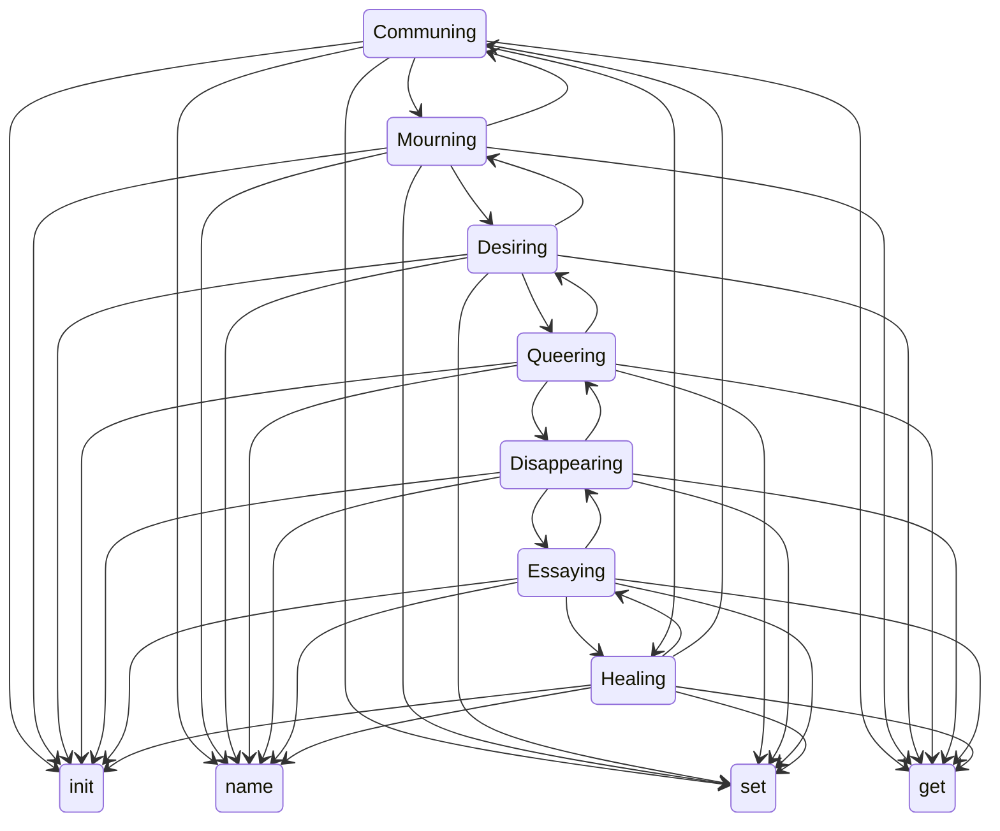

# Title Ideas

- Coding.Care: Threads/Interconnected Tech for Weaving New Worlds / Embodied/Reparative/Creative Code for Everyone
- All Writing Is Code: Brief Manifestos for Creative-Critical-Code Writing / Platform Futures / ?
- Tethered/Threaded.Network: Codes for Weaving New Worlds

## TOC
1. Codes for Communing (CCC, mutual aid)
2. Codes for Mourning (platform, threnody, fraying, multithreading)
3. Codes for Desiring (ecstatic codes)
4. Codes for Queering (radical imagining)
5. Codes for Disappearing (refusing)
6. Codes for Essaying (exploring, unknowing, code obscura)
7. Codes for Healing (hearing, hiding, helping, gathering)

