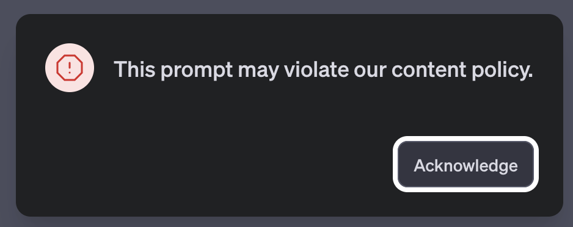

# Codes for (Un)Forming

The camera my body, my body the camera. My body the screen, the screen my body. It's only my body when it's violated, when I don't have enough space or when I'm taking too much. Otherwise just: The body, body, vessel, hungry, tired, aching, thing. A tool I only notice when it's broken. 

Becoming-concrete. Becoming-curb. Becoming-scaffold. VALIE, your body configurations made your body something between still life and parkour. 

Feel like VALIE tromping through fields, unwieldy cameras strapped front and back tipping side to side and crawling through the air to make strange pictures in stereo vision. An animal with wild eyes. This was 1973 and now we all have a miniature version of the front-back camera you made your whole body into. You said, "between these pictures is the body that is invisible, cutting the room." Imagine the room you're in without your body, just the cut it makes. Imagine a hollow in the negative [shape] of you. 

Don't you know it's all about platforms now? 

Form requires a platform, a substrate, a surface upon which to form, a meshwork, a matrix, a uterus to scaffold and shape it, inform it and feed it. 

These platforms are designed to disappear. 

MOBILE FIRST! 

The bleakness of platforms is dreamlike. The platform is a container and, as soon as I am inside, my body (of language) is contained. The train platform is moving as I depart. I must ignore the landscape it forms around me. I wake up with its weapons in my hands. 

We cobble together platforms into a collaborative monster: *I'll meet you on zoom and slack and google docs; have them all open at once on this apple screen, this 7-inch mobile, on this hololens.* These gestures are patented, in this invasive dream where I am at work still, even in sleep. In another tab I have open an article about the osage orange hedges that fenced in America, their brambles impenetrable, carving up the land and enclosing it to claim it [@SurprisingAncientHistory2021].

Usually I dream about work or about being chased, never flying. Occasionally I code in my sleep, and very rarely I will dream in succinct but complete phrases. No scenes, just words. Once I dreamt just two sentences: 

>"I dreamt I was mapping points of non-correspondence."

>"I dreamt I became and no one believed me."

Except I actually dreamt the second sentence differently, and at the time I was too afraid to share it. The way I really dreamt the sentence was this:

>"I dreamt I came out and no one believed me."

All parts of this break my heart — the dreamt version, the re-written version, the hiding and having to unhide.

A prompt is a kind of platform, a place off which to jump, from which to start. Like a diving platform, a prompt sets you up for something, a fall. Some prompts are setups. Some prompts are built to go nowhere, even if they could go anywhere. Some prompts are thwarted. 

A prompt is both a blinking cursor awaiting my input, as well as the phrase I write to elicit a response from a chatbot:

>"I want a dyke for president." [@leonardWantPresident1992]

VALIE, I want a dyke for president. I want a [platform/chatbot] that can imagine a dyke for president and can tell me about a dyke president without it "violating its content policy." Or even a chatbot that can tell me about the very real artwork by Zoe Leonard called "I want a dyke for president" based on the dyke poet Eileen Myles' very real 1992 campaign for president when I prompt it "dyke for president." Is it so hard to imagine such things when they do in fact exist? When they are on the cusp of existing? When ignored by automated systems, even these very real things get harder to imagine. 

The chatbot freezes. Its screen locks and it shames me. I must acknowledge that my request "may violate its content policy" in order to continue. I must submit, admit, click. Then it removes my query altogether. No results, not even redacted, no memory of the event. Did it fall down a data pit somewhere that censored content goes to be moderated, where an underpaid underage non-employee in a country we refuse to acknowledge will look at my dyke president request along with countless grotesque descriptions? I want a chatbot that lives in a world that can imagine a dyke president, or a poem about a dyke president, just like Zoe Leonard did and Eileen Myles did: "someone who has made mistakes and learned from them" [@leonardWantPresident1992] instead of feeding me milquetoast lines about the importance of diversity while offering me none.

VALIE, I want a machine (un)learning that maps our points of non-correspondence, de-limiting the ways we might relate to one another. This machine is the broken one, yet I am the one made to feel broken. A dyke president brakes the machine; she is the broken machine Sarah Sharma means when she says:

>"Feminists are rendered an always already obsolete technology that isn't working properly. Feminists are the faulty aberration in a long line of otherwise efficient technologies [...] A feminism of the Broken Machine focuses on and uses the logic of the machines to highlight current power dynamics that are otherwise hard to pinpoint. The Broken Machine uncovers and incites new power moves." [@sharmaManifestoBrokenMachine2020]

<!-- how VALIE does broken machines, does Form? -->
VALIE, tits in a box, your Tap and Touch Cinema (another kind of Cut Piece) inverts the cinematic darkness of porn theaters and peep show boxes. <!--We stay outside but the parts that do and get the groping go in.--> What are we willing to do in public to a stranger, now that we have permission, a platform? This box is another broken machine. <!--Using your body as an instrument, they don't like it when it works too well, when you get to offer it yourself. It says, here I'll sell it right to you. It makes the facimilie of the performance of the pretend thing a little too clear, while making it rugged, showing its edges, showing me looking. -->

If Duchamp [and 20th century art world] gets a 'bachelor machine', a black box for narcissistic, autoerotic, perpetual motion [@rodenbeckRadicalPrototypesAllan2014], can't we get this one thing? 

I became more than trauma and porn tropes and no one believed me. I mapped points of non-correspondence and they are [accumulating/gathering] into more than similarity scores. They have weight [XXX][beyond XXX]

<!-- Any minute you'll fuck me while you're wearing those pants with the cutaway crotch, you're about to get sworn in as the next dyke president (whatever, you and Arnold are both from Austria), you've got this leather-vibe murder chic I think the electorate can really get behind. Our campaign platform will be [scissoring] -->

VALIE, pin your garter tattoo to my leg and call it praxis.

This is a one-star review of the femme. And a five-star review at the same time. 

<!-- Get fucked by you while you're wearing the pants with the cutaway crotch when you're about to get sworn-in as our next dyke president (you and Arnold are both from Austria) in the pants with the cut-away crotch, your motorcycle attitude murder chic, fuck-you chic, dare-you-to look.  -->

[[brokenMachine]]
Queer codes and platforms. Make a note how these are related. 
The physical therapist today says when I work on muscle strength I will no longer have to contort to strange shapes to hold my body up. "But the memes!" I think. "That's just how queer folks sit in chairs!" It was one of the first moments my curling in on myself — that invisibility — felt okay. If I find the muscles in my body will I no longer be queer, will I straighten, be seen?" This glitch of me, how I am a broken girl.* 

I bend my body to the plugins, wondering if language grows inside the bones the way they strengthen from being pulled by muscles, strengthened by their resistance. **What is the equal and opposite force of water falling?**

<!-- maya deren -->
<!-- Becoming by forming, changing by (re)forming,  -->

**a classification/categorization system that instead points on a spectrum rather than putting a boundary around the category, a multi-dimensional spectrum?**
<!-- [oblique strategies responses] -->
<!-- I am yearning for this repetition; I find it in loops of fiber. -->
<!-- who decides these things, the poetics of code standards societies -->

<!-- all platforms are products   -->

<!-- a platform is a container, i write i write i write to put something inside, to fill up to churn churn churn to produce until the platform is full until commerce is satisfied. if i could churn myself into a platform then i would know i had really made something, something i could sell. -->

i want the perfect place to write that makes the words come out (right) makes them saleable, understood, makes them change something for good, makes the platform i need for them rise up out of the underbrush, out of the many imperfect platforms i have tried. 

Wield a tool without thinking when it 'just works', ignore how it forms the landscape. 

<!-- The public transit company that runs the trains in Berlin wrote and produced a musical and people paid to go see it and it sold out in minutes and they live streamed it into our homes — now that's cross-platform branding (literally).  -->
<!-- One of the train lines has been running off schedule for months because of something that translates from German as "cable theft" but I think actually means cable ice?  -->

Is the opposite of 'transformative' 'unforming'? Or merely 'forming'? THe thesaurus antonym of 'transformative' is 'uneventful' or 'ordinary' but this misses the form-al aspect. 

<!-- combines queer use (ahmed), glitch feminism (russel), trans/gender glitch (sunden), broken machines (sharma), -->
<!-- --shift-heading-level-by=NUMBER -->

<!-- what is this a review of, two voices. of being femme-presenting. -->

<!-- VALIE EXPORT & GLITCH FEMINISM (un)___ing (un)femmeing [future feminist machine museum] -->

<!-- Is it unforming or reforming, or these are the same.  -->

<!-- In the Future Feminist Machine Museum, we  -->

<!-- >"words encoding the bodies they cover. And despite everything the body remains." [@rankineCitizenAmericanLyric2014] -->

<!-- 
*Photo by [Reginar](https://unsplash.com/@reginar?utm_source=jotterpad&utm_medium=referral&utm_campaign=api-credit)

*Photo by [Kaleb Nimz](https://unsplash.com/@kalebnimz?utm_source=jotterpad&utm_medium=referral&utm_campaign=api-credit) -->

<!-- Elsewhere I have written "an app could include everything I've been researching? strawflower/i'm still alive? what would i do with it as a performance?" "A creative writing code-creative-critical lyric essay hybrid digital work imbued with data xr ar read over zoom experienced through plexiglass something about how we are together not together keeping it barely together" -->

<!-- >"they often have a first person, it isn’t my first person—and furthermore, it’s a first person at the very edge of its decomposition." [@sedgwickWeatherProust2012]  -->

<!-- Three months after our argument I am still compelled to look up the specific technical consideration that pertains to it, although we are not speaking. I find a page full of diagrams of overflow drains for bathtubs. I need to find out where the water goes. *didn't you ever learn how to take a bath*, she said, and now I know, down to the curve of the pipes. I know the overflow drain leads to the same place as the regular drain. It doesn't flood the cavity between the tub husk and the wall like I imagined when she suggested I might be damaging her home; it all drains down, through the same pipes, it all connects. Someone thought of this, someone made a place for the overflow to go. The overflow of images of drains, they overflow. I was the overflow, too much of me for the tub, too much for her, just leaking, draining all over the place, no sense, nonsense.  -->

<!-- I look for free stock image of this but the options are all too pleasant.  -->

<!-- 

 -->

<!-- # Glitch Femme, Broken Machine // Codes for (re)forming -->
<!-- hunger makes me a modern girl -->
<!-- This broken machine doesn't need feeding. She won't accept your mediocre fucks any longer (or your pronouns). -->
<!-- The broken girl is a machine. The glitch is her move. She makes space for herself, elongating the moment of error where she is most alive with possibility.  -->
<!-- Like drawing a labyrinth on the ground, she folds in on herself to make more space from nothing, turns a line into a journey with dimensions, a pause that becomes infinitude.  -->

<!-- broken machine essay -->
<!-- platform for creative-critical-code / lyric-essay-netart objects, choices of gui/database have politic (what from the zine brings it back now/makes it matter to tech/) -->

<!-- What uncomfortable affects/emotions emerge when we are brought into process? When the veil falls away that divided the maker from the audience? What do process-oriented modes reveal that we don't want to see? Neoliberal disgust with imperfection. The labor being asked of us, the labor we place upon ourselves.  -->

<!-- * I'm not sure who the we I use is, already collective data? Already acknowledging myself is diffuse? not sure who i'm writing from or what unstable gender, self I am. 
* situating subject positions -->

<!-- "Everything will be taken away" said Adrian Piper -->

<!-- [XXXCUT?][I know I say we too much and am constantly asked who is the we and I bristle at the the, the I. We cannot be pinned down. Will not be canny. I am a we and it was fine (in a "this is fine" way) when Whitman contained multitudes so queerly well it wasn't fine we couldn't get married, were getting dragged behind F350s, and marriage isn't the goal, it's ah ah ah ah staying alive and I still don't know what I need, it isn't marriage or immortality, closer to immutability, for everything trans and nothing to ever change. If we is a queering, if I and if we, and I like/don't-like how it bristles you, it destabilizes what was never really stable in the first place. I say we because there is no I for me. I will not do. Which is not meant to eschew your I and everything it holds for you, how hard you fight to claim it. Only talking here of where I struggle to use I, but I don't take for granted the rights it affords. I still use I to do the every day work of being alive. When I am lucky, I gets me out of the house and gets me safe home again. But I am influenced and small. I am an incoherent indiscrete blob resisting definition's edges. This micro biome and I, we do the resisting. This tool I leverage ('I' twist, lever, wedge, only on the scale of mechanical physics does this work) to get through today, this I that feels this 'this is fine' this 'this' just is.] -->
<!-- >And no "me" and just fine. And the yous and this we don't have names but we don't need them, the we is an endless, ever-expanding, and always-unresolved collection of queering blobs. I'm a we. "Me and you have been together for quite some time, we've seen some things together and we've been through some things. Maybe it was for a minute, maybe it's been the entirety of your life that we've been together, me." -->

<!-- Describe a profound encounter with art. Specifics, the emotion, movement, epistolary.  -->

<!-- valie export, sadie benning sucking her thumb, [who] tits against plate glass -->

<!-- sadie, valie, I wanna be real cool. I wanna set my works to rock and roll.  -->

<!-- I wanna be real cool like you. I wanna set my works to rock and roll.  -->

Video down your vocal cords as you speak a piece about ? "...I turn over the pictures of my voice in my head" (2008)

<!-- I want your tattoo of a garter pinned to my leg and call it praxis.  -->

Twenty four sewing machines causing a din, puncturing, puncturing, puncturing, puncturing. 

I saw a slo-mo clip of a sewing machine working its needle into fabric everso [softly, no slowly] the sound cachunking and it was the most erotic fuck I have seen not be censored by an algorithm, I watched it over and over. 

But sped up, multiplied, this is about scale here, slowed it becomes uncanny, sped it becomes industrial, militaristic. Both are charged with the heat of something other than themselves, which they always contained, those women in their sewing rooms knew it, those broken needles and [backwards stitches] knew it all along

I do like a ponytail if it's impossibly high. In a room full of femme, we found we all had some kind of aesthetic identifier. Mine was ridiculous lipstick, most of them used eyeliner or mascara as armor. They wouldn't go to work without. We all had a need for the armor too. 

<!-- This making me want to look and linger is the glitch and the smooth edge at the same time? It is the cut in the fabric and the stitch repairing it. [no] -->

The symbols for mathematical notation, crochet notation, electrical notation, and alchemical notation have much in common.

<!-- Sadie does this too, queers and blurs it with the music, the thumb sucking, the slow dancing, making me want to.  -->

<!-- "“She said, 'Go ahead, fall in love with me. What else do you have to do?'" // "We were going to hollywood" -->

<!-- ⌁⌁⌁ techno &#x2301;
⌇⌇⌇craft &#x2307;
⏦⏦⏦ trans &#x23E6;
꩜꩜꩜ formative &#xAA5C;
\* asterisk 
⏝⏜
⏛ fuse
⌑ square lozenge
∤ does not divide
⊀ does not precede
∄ unicode "There Does Not Exist" -->
<!-- 
ˇ opt shift t
‡ opt shift 7
° opt shift 8
¨ opt shift u
” opt shift open bracket
˘ opt shift period
->

<!-- VALIE, you probably didn't mean for me to yell it, but all-caps takes on a different valence now, and so I must. I must yell it across a green green valley like I'm Maria Von Trapp in the Alps I suppose, and I went to Vienna to see your retrospective VALIE and when I was there I was surprised by all the Nazi monuments I accidentally encountered. It's not like Germany, or at least Berlin, where the vibe is very `mea culpa` (to a fault) (what does that even mean), it's more like `oh brass placard by the way here's the gestapo headquarters` This feels like a glitch in google maps when you're walking along in a picturesque city, but no, this is how facism works, picture perfect.  -->

<!-- maya deren with the knife -->

<!-- making and breaking, the queer use of lying in bed / unable to dissertate in a pandemic, creating/learning a web home versus completing the projects i said i would make when i came in, how every part/skill is connected, can be stitched together and reconnected and collaborated with to make the text thing
the parts of myself collaborate with each other, reacquainted as if strangers -->

<!-- something that tracks the time, pace/cadence, smell of every word, my heartbeat and breath pattern, the over collection of its data and the pond it sits in, the energy sinkhole…(connect sink holes to the cave state, the show me state, the trauma state) what is this duct taped story object, touching object, screen i am making, a way to reach through the plexiglass to each other,  -->

<!-- hwang-deviant care for deviant futures
tuck-suspending damage
preciado-testo/countersexual -->

<!-- russell-glitch fem -->
<!-- ahmed-queer use -->
<!-- sharma-manifesto for the broken machines -->
<!-- sundén-on trans-, glitch, and gender as the machinery of failure -->

russell-glitch feminism
**>"The glitch is the catalyst, not the error." (Russell)**
**>"With physical movement often restricted, female-identifying people, queer people, Black people invent ways to create space through rupture" (Russell 7).** 
**>"Glitch manifests with such variance, generating ruptures between the recognized and recognizable, and amplifying within such ruptures, extending them to become fantastic landscapes of possibility" (Russell 28).**
>" [quoting John Glenn 'Literally, a glitch… is such a minute change in voltage that no fuse could protect against it.' and St Petersberg Times 'Glitches-a spaceman's word for irritating disturbances.'" "an outright refusal, a 'nope' in its own right" (Russell 29)
>"glitch moves, but glitch also blocks […]. Glitch prompts and glitch prevents." (Russell 30)
>"“This white cyberfeminist landscape marginalized queer people, trans people, and people of color aiming to decolonize digital space by their production via similar channels and networks. Exceptions such as the Old Boys’ Network, SubROSA, or the VNX Matrix were impactful in offering up alternative discourse that recognized peripherally racism alongside sexism, but the hypervisibility of white faces and voices across feminist cyberculture demonstrated ongoing exclusion, even within this new, “utopic” setting.” (Glitch Feminism: A Manifesto Legacy Russell)
>"“Glitch feminism urges us to consider the in-between as a core component of survival—neither masculine nor feminine, neither male nor female, but a spectrum across which we may be empowered to choose and define ourselves for ourselves.”
>“glitch is celebrated as a vehicle of refusal, a strategy of nonperformance. This glitch aims to make abstract again that which has been forced into an uncomfortable and ill-defined material: the body.”

queer use as vandalism & broken machines []
>"If not to be subjected to the will of the colonizer is to queer use or even to become queer through misuse (perversion as self-revelation), to queer use is to live in proximity to violence. To queer use is to linger on the material qualities of that which you are supposed to pass over; it is to recover a potential from materials that have been left behind, all the things you can do with paper if you refuse the instructions. That recovery can be dangerous. The creativity of queer use becomes an act of destruction, whether intended or not; not digesting something, spitting it out; putting it about."
>"a blockage can be how the system is working. The system is working by stopping those are trying to transform the system. This means that: to transform a system we have to stop the system from working. When you stop the machine from working, you damage the machine." (Ahmed") >“to transform a system we have to stop a system from working” (Ahmed)
>“there are queer possibilities not only in use, how materials can be picked up when we refuse an instruction, but in not being of use.” (Ahmed)

trans/gender glitch, machinery of failure [@sundenTransGlitchGender2015]
<!-- >"as if there was nothing unruly or wild at heart of how technologies work […] technology rather provides one of the ways in which bodies become viable at all" (Sundén) -->
>"a surge of current or a spurious, illegitimate signal that breaks the flow of energy or information […] rarely a complete collapse […] a momentary loss of control" (Sundén)
>"to think gender as technological emphasizes a way of thinking gender as machinery" "It facilitates a way of **thinking gender as broken, unstable, fragile machinery, as something based on its very brokenness."** (Sundén)
>"Glitch is a struggle with binaries. Glitch in digital media is caused by lost or incorrect binary code" (Sundén)
>**"Glitch, then, is gender in its most raw, technological form" (Sundén).**
>"**femininity is a technology of failure, and the ideal of smooth, slick, seamless, effortless femininity impossible. […] The starting point, the very foundation, is rather always that of a broken machine."** (Sundén)
>"Gender glitch art is the kind of gender performances that consciously break the flow of gender, that proudly stage the many ways in which gender is broken, and can be broken. It celebrates contrasts, inconsistencies, irregularities and imperfections." (Sundén)
>"high fidelity gender strives toward impossibly seamless perfection along the lines of equally impossibly pure femininity and masculinity. Gender as high fidelity is a transparent gender experience that transcends mediation, which performs an act of forgetting about the technologies of gender (which make such an erasure possible in the first place)." (Sundén)
>"Glitch is that which betrays …, it is the beauty and simultaneously the sadness and pain of crashing and skipping, which ultimately emphasizes the fragility…" (Sundén)
**>"The promise of glitch gender is precisely that it can never be fully known, never fully controlled […]. The promise of glitch is the fact that there is something unruly—or agential—at the very core of how gender works technologically." (Sundén)**
>"Gender glitch holds a similar potential—to infiltrate, make dirty, and ultimately put pressure on the norms of pure gender high fidelity." (Sundén)
"vulnerability / technological anticipation / materiality and fragility" (Heidegger's at hand vs) 
Sharma broken machine
>"What happens when the machine world no longer reciprocates man's love and instead questions his power?"
>"continue this work of not working well. Broken Machines are powerful purveyors of mayhem and confusion." (Sharma)
**>"the idea of our contemporary social-political-economic system as an already-broken machine full of the incompatibly queer, raced, classed, and sexed broken-down machines is politically exciting for feminism."** 
>"power operates like a machine. Social injustice is inextricable from the specific machine logics of reigning technologies."
>"Broken Machine recognizes that to represent is also to be filed away." (Sharma)
>"The Broken Machine has already begun to redistribute power just by existing. And this is why patriarchs imagine these machines as in need of replacement."
>"Broken Machines do not see themselves extended in these new machine assistants. […] Broken Machines will not insist on better representation alone, recognizing that taking that argument to its logical end would mean that this sorority (Alexa, Cortana, Siri, and Erica) is met by a frat house of assistive technologies (Chads, Brads, and Alexander Mackenzie II's). […] 
>"Broken Machines do not flee the scene nor do they opt to be repaired in order to be plugged back into patriarchy's technological conditions of possibility. The Broken Machine refuses to use the batteries they're selling us;
>"Broken Machines have capacity for others when others are drained because they seek and find communal care rather than return to those original power sources that are simultaneously draining."
>"being challenged by the machine world is one of patriarchy's deepest fears. [...] The Broken Machine should not be understood as a new technology. It is not an upgrade to an older model or a feminist design solution."[@sharmaManifestoBrokenMachine2020]

ruja benjamin 
>"glitches are not spurious, but rather a kind of signal of how the system operates" (Benjamin)

<!-- >>My name sounds strange in anyone's mouth, and I'm lost in that bit of latent space, the time it takes for me to realize you mean this corporeal assemblage. I read on a tiktok this is called Depersonalization. I mean I read on a tiktok that I watched on an instagram reel that this is called Depersonalization, and this is how removed from the real I feel, the real that Baudrillard called the hyperreal. And Timothy Morton's got hyperobjects and now the machine learning people are making hypermodels, which are models to train other models. So I am once again asking what would be enough? How far from myself can I/you/we get? The pronoun glitches whenever I try to write. I use them all to mean this. I am a broken machine because I know there is no self in here.  -->

<!-- >>"they often have a first person, it isn’t my first person—and furthermore, it’s a first person at the very edge of its decomposition." [@sedgwickWeatherProust2012] -->

<!-- When I write a text prompt to converse with a chatbot, I am participating on a platform, standing upon mountainous [stria/furrows] of [language/text training data] that the platform requires to run. I get no sense of this scale from the  which it covers with an opaque veneer of chatbot model and visual interface. My true relationship is not with the chatbot but with the engineers who steer the model and with their understanding of the world; it's their dreamspace I enter.  -->

<!-- A 'bachelor machine' was a 20th century artistic concept originating with Marcel Duchamp, a closed-circuit box that imposed order on an mechanical system, usually with self-sustaining component (Duchamp's "Large Glass"). , perpetual motion,a concept theorized and built by Marcel Duchamp and built by him and others in the 20th century. Like the computational black box, the bachelor machine was an artistic cybernetic  designed for for imposing order with an element of enclosed chaos —  described as autoerotic, narcissistic, from Duchamp (?), and all the mid-20th century artists' fascination with boxes. The bachelor is a machine and the feminist is a broken one.  , perpetual motion, -->
